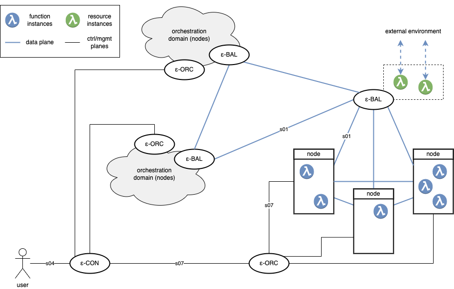

# EDGELESS Reference Implementation

This repository contains a research prototype of the EDGELESS platform, which is
under active development within the project [EDGELESS](https://edgeless-project.eu/).

*There currently are no guarantees on Stability and API-Stability!*

## Introduction

EDGELESS is a framework that enables _serverless edge computing_, which is
intended especially for edge nodes with limited capabilities.



An EDGELESS cluster consists of one or more _orchestration domains_ (three in
the example figure above) managed by an ε-CON (controller).

Users interact with the ε-CON to request the creation of _workflows_.
A workflow specifies how a number of functions and resources should interact
with one another to compose the service requested by the user by sending to one
another _asynchronous events_ that are akin to function invocations.
_Functions_ live entirely within the realm of the EDGELESS run-time, while
_resources_ may interact with the external environment, e.g., handling events
in a resource may have a side effect, such as updating an entry on an external
in-memory database or reading the value of a physical sensor.

Functions are _stateful_: a given function instance is assigned to exactly one
workflow, thus the function developer may assume that data will generally
remain available across multiple invocations on the same function instance.
However such state is:

- tied to the specific instance: if there are multiple instances for the same
function, then there is no consistency guarantee across the multiple states;
- ephemeral: if a function instance is terminated, then there is no effort to
save/persist the state.

Furthermore, unlike many other serverless computing platforms, workflows may
consist of a wide variety of function compositions, as illustrated below.


An orchestration domain contains:

- one ε-ORC (orchestrator) that manages the scaling of function instances and
resources within its domain;
- one ε-BAL (balancer) that plays two roles:
  1) realization of an inter-domain data plane, to allow events generated by a
  function instance in an orchestration domain to be consumed by a function
  instance in another orchestration domain;
  2) configuration and management of the resources;
- one or more nodes, which can host the execution of function instances of a
given workflow in a [WebAssembly](https://webassembly.org/) run-time environment.

The byte code of the function instance is provided by the user when requesting
the creation of a workflow, which also includes _annotations_ to specify the
Quality of Service requirements (e.g., maximum completion time) and workload
characteristics (e.g, average invocation rate), as well as affinity of
functions to specific hardware properties (e.g., GPU required) or preference
for other system parameters (e.g., location, owner, price).
Depending on the annotations, the set of active workflows, and the current
system conditions, the ε-CON may reject the workflow creation request.

### Known limitations

Currently there are several known limitations, including the following ones:

- the dataplane within an orchestration domain is realized through a full-mesh
- interconnection between all the nodes and the ε-BAL;
- the ε-CON only supports a single orchestration domain and does not perform
- any kind of admission control;
- the ε-ORC only supports a single node;
- all the workflow- and function-level annotations are ignored;
- there are only types of resources:
  - http-ingress: to ingest of HTTP commands from external web clients;
  - http-egress: to execute HTTP commands on external web servers;
  - file-log: to save to a node-local file strings;
  - redis: to update a value on an external [Redis](https://redis.io/) server;
- the payload of events is string-only and not encrypted;
- the configuration of the ε-CON, ε-CON, and ε-BAL is read from a file and
cannot be modified (e.g., it is not possible to add an orchestration domain
or a node while running);
- there is not persistence of the soft states of the various components.

The full list of issues is tracked on
[GitHub](https://github.com/edgeless-project/edgeless/issues).

Stay tuned (star&watch [the GitHub project](https://github.com/edgeless-project/edgeless))
to remain up to date on future developments.

## How to build

See [building instructions](BUILDING.md).

## How to run

It is recommended that you enable at least info-level log directives with:

```
export RUST_LOG=info
```

To get the basic system running, first create the default configuration files
(they have fixed hardcoded values):

```
target/debug/edgeless_inabox -t 
target/debug/edgeless_cli -t cli.toml
```

which will create:

- `balancer.toml`
- `controller.toml`
- `node.toml`
- `orchestrator.toml`
- `cli.toml`

Then you can run the **EDGELESS-in-a-box**, which is a convenience binary that
runs every necessary component as one, using the generated configuration files:

```
target/debug/edgeless_inabox
```

Congratulations 🎉 now that you have a complete EDGELESS system you may want to check the the `examples/` directory, which contains several workflows/functions that are representative of the current EDGELESS features.

You can find [here](examples/README.md) the full list with a short description of each.

## Next steps

Please refer to the following specific docs:

- [Repository laytout](documentation/repository_layout.md)
- [How to create a new function](documentation/rust_functions.md)
- [How to compose a new workflow](documentation/workflows.md)

## Contributing

We love the open source community of developers ❤️ and we welcome contributions to EDGELESS.

However, since the codebase is growing fast, you are encouraged to disclose your potential contribution beforehand on GitHub by [creating a new discussion item](https://github.com/edgeless-project/edgeless/discussions/new/choose).

This section contains some rules you should adhere to when contributing to this repository.

* Run the rust formatter before committing - `cargo fmt`. This ensures we
  minimize the noise coming from, e.g., whitespace changes.
* Try to limit the number of warnings (ideally, there should not be any
  warnings). A good way to do this is to run `cargo fix` before running the
  formatter.
    *  Suggested workflow: `cargo fix --allow-staged --allow-dirty && cargo fmt
       && git commit`
* When working on a new feature / issue, create a branch from the GitHub issue
  and add your changes there. To merge the changes into the main, create a pull
  request and assign someone as a reviewer. The reviewer should then reject or
  accept the changes / leave some comments. After the changes are accepted by
  the reviewer, he should take care to merge them and remove the dangling
  feature branch.
* Do not introduce merge commits on the main branch. Merges to the main branch
  must be fast-forwarded. A good practice is also to squash the commits on the
  feature branch (this can be done while merging on GitHub).
* Add yourself to the list of contributors & adhere to the license.
    * Do not taint this repository with incompatible licenses.
    * Everything not MIT-licensed must be kept external to this repository.

## License

The Repository is licensed under the MIT License. Please refer to
[LICENSE-MIT.txt](LICENSE-MIT.txt) and [CONTRIBUTORS.txt](CONTRIBUTORS.txt). 

## Funding

EDGELESS received funding from the [European Health and Digital Executive Agency
 (HADEA)](https://hadea.ec.europa.eu/) program under Grant Agreement No 101092950.
