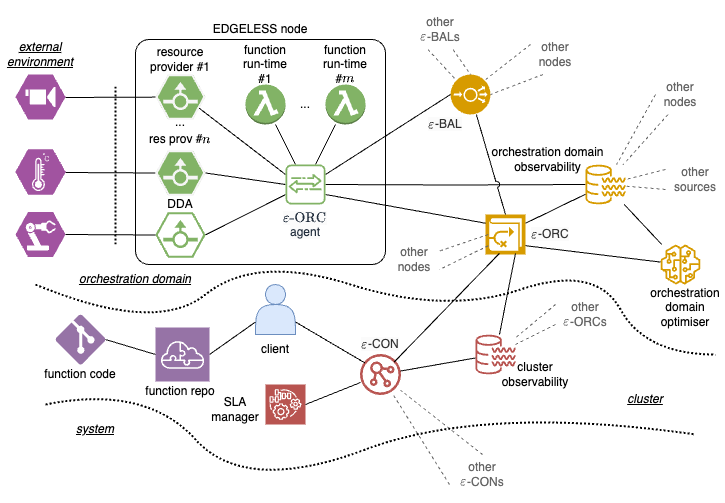
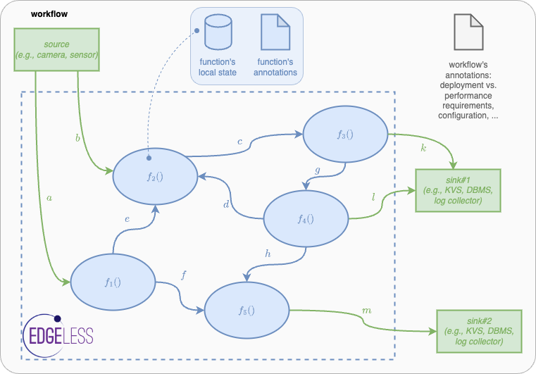
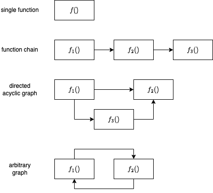

<a name="readme-top"></a>


<div align="center">

  [![Contributors][contributors-shield]][contributors-url]
  [![Forks][forks-shield]][forks-url]
  [![Stargazers][stars-shield]][stars-url]
  [![Issues][issues-shield]][issues-url]
  <!-- [![MIT License][license-shield]][license-url] -->
  <!-- [![LinkedIn][linkedin-shield]][linkedin-url] -->

</div>
[Report error](https://github.com/edgeless-project/edgeless/issues/new?assignees=&labels=&projects=&template=bug_report.md) · [Feature request](https://github.com/edgeless-project/edgeless/issues/new?assignees=&labels=&projects=&template=feature_request.md)

# EDGELESS Reference Implementation

This repository contains a research prototype of the EDGELESS platform, which is
under active development within the [EDGELESS project](https://edgeless-project.eu/).

> [!NOTE]
> There currently are no guarantees on Stability and API-Stability!

<details>
<summary>Table of Contents</summary>

- [EDGELESS Reference Implementation](#edgeless-reference-implementation)
  - [Introduction](#introduction)
  - [Architecture Overview](#architecture-overview)
    - [Workflows](#workflows)
    - [Resources](#resources)
    - [Functions](#functions)
    - [Details](#details)
    - [Known limitations](#known-limitations)
    - [Repository structure](#repository-structure)
  - [How to build](#how-to-build)
  - [How to run](#how-to-run)
  - [Next steps](#next-steps)
  - [Contributing](#contributing)
  - [License](#license)
  - [Funding](#funding)
</details>

## Introduction

EDGELESS is a framework that enables _serverless edge computing_, which is
intended especially for edge nodes with limited capabilities.

## Architecture Overview



An EDGELESS cluster consists of one or more _orchestration domains_ (one in
the example figure above), managed by an ε-CON (controller).

An orchestration domain is made up of:

- **1 ε-ORC** (orchestrator) that manages the scaling of function instances and
  resources within its domain;
- **1 ε-BAL** (balancer) that plays two roles:
  1) realization of an inter-domain data plane, to allow events generated by a
  function instance in an orchestration domain to be consumed by a function
  instance in another orchestration domain;
  1) configuration and management of the resources;
- **$\ge$ 1 nodes**, which can host the execution of the function instances of a
  given workflow, either within a [WebAssembly](https://webassembly.org/) run-time 
  environment or inside a [Docker container](deployment/).

### Workflows

Users interact with the ε-CON to request the creation of _workflows_.
A workflow specifies how a set of *functions* and *resources* should interact
with one another to compose the service requested by the user, by sending
_asynchronous events_ to each other that are akin to function invocations.

EDGELESS _functions_ live entirely within the realm of the EDGELESS run-time, while
_resources_ are capable of interacting with the external environment, e.g. handling events
in a resource may have a side effect, such as updating an entry in an external
in-memory database or reading the value of a physical sensor.



### Resources

Following their configuration fiels, EDGELESS nodes can host one or more
resource providers, but a node cannot have more than one resource of a given
type.
The resource provider ID in the configuration has a double purpose:

- if empty, then the resource provider is not created;
- otherwise, it is created and that's the identifier used.

The resource provider ID is used by the ε-ORC to identify the resource
providers, thus their names must be unique within an orchestration domain.
When deploying workflows, users can request that a resource instance is created
on a given resource provider using the `resource_match_all` annotation.
Imagine for instance that a resource provider is a digital twin for a physical
resource, e.g., a camera: it would very important for the user to be able to
identify precisely that resource provider.

The resource providers currently shipped with EDGELESS are reported in the table
below.

| Type           | Description                                                                              | Node configuration                                             | Run-time configuration                                             | Example                                  |
| -------------- | ---------------------------------------------------------------------------------------- | -------------------------------------------------------------- | ------------------------------------------------------------------ | ---------------------------------------- |
| `dda`          | Interact with a [Data Distribution Agent](https://github.com/coatyio/dda)                | dda_url, dda_provider                                          | dda_url, dda_com_subscription_mapping, dda_com_publication_mapping | [click](examples/dda_demo/README.md)     |
| `file-log`     | Save log lines to a node-local file                                                      | file_log_provider                                              | filename, add-timestamp                                            | [click](examples/file_log/README.md)     |
| `http-egress`  | Execute HTTP commands on external web servers                                            | http_egress_provider                                           |                                                                    | [click](examples/http_egress/README.md)  |
| `http-ingress` | Ingest HTTP commands from external web clients                                           | http_ingress_provider, http_ingress_url                        | host, methods                                                      | [click](examples/http_ingress/README.md) |
| `kafka-egress` | Send a message to an external [Apache Kafka](https://kafka.apache.org/) server           | kafka_egress_provider (requires `rdkafka` feature)             | brokers, topic                                                     | [click](examples/kafka_egress/README.md) |
| `ollama`       | Interact via an LLM ChatBot deployed on an external [ollama](https://ollama.com/) server | host, port, messages_number_limit, provider (separate section) | model                                                              | [click](examples/ollama/README.md)       |
| `redis`        | Update a value on an external [Redis](https://redis.io/) server                          | redis_provider                                                 | url, key                                                           | [click](examples/redis/README.md)        |

With `edgeless_node_d --available-resources` you can find the list of resource
providers that a node supports, along with the version, output channels, and
configuration parameters for each resource provider.

### Functions

Functions are _stateful_: a given function instance is assigned to exactly one
workflow, thus the function developer may assume that data will generally
remain available across multiple invocations on the same function instance.
However such state is:

- tied to the specific instance: if there are multiple instances for the same
function, then there is no consistency guarantee across the multiple states;
- ephemeral: if a function instance is terminated, then there is no effort to
save/persist the state.

Furthermore, unlike many other serverless computing platforms, workflows may
consist of a wide variety of function compositions, as illustrated below.



The byte code of the WASM function instance or the name of the Docker
container to be started is provided by the user when requesting
the creation of a workflow, which also includes _annotations_ to specify the
Quality of Service requirements (e.g., maximum completion time) and workload
characteristics (e.g, average invocation rate), as well as affinity of
functions to specific hardware properties (e.g., GPU required) or preference
for other system parameters (e.g., location, owner, price).
Depending on the annotations, the set of active workflows, and the current
system conditions, the ε-CON may reject the workflow creation request.

### Details

Some components/features are illustrated separately:

- [Orchestration model](orchestration.md)
- [Support of Docker containers](container-runtime.md)

### Known limitations

Currently there are several known limitations, including the following ones:

- the dataplane within an orchestration domain is realized through a full-mesh
  interconnection between all the nodes and the ε-BAL;
- the ε-CON only supports a single orchestration domain and does not perform
  any kind of admission control;
- no workflow-level annotations are supported; 
- the payload of events is not encrypted;
- the configuration of the ε-CON, ε-CON, and ε-BAL is read from a file and
cannot be modified (e.g., it is not possible to add an orchestration domain
or a node while running);
- there is no persistence of the soft states of the various components.

The full list of issues is tracked on
[GitHub](https://github.com/edgeless-project/edgeless/issues).

Stay tuned (star & watch [the GitHub project](https://github.com/edgeless-project/edgeless))
to remain up to date on future developments.

### Repository structure

| Directory                                        | Description                                                                                                                                                                                                                                           |
| ------------------------------------------------ | ----------------------------------------------------------------------------------------------------------------------------------------------------------------------------------------------------------------------------------------------------- |
| deployment                                       | Docker and Docker Compose scripts                                                                                                                                                                                                                     |
| docs                                             | Repository documentation.                                                                                                                                                                                                                             |
| edgeless_api                                     | gRPC API definitions, both services and messages. This directory must be imported by other projects wishing to interact with EDGELESS components through its interfaces. The following interfaces are currently implemented: s01, s04, s06, s07.      |
| edgeless_api_core                                | Work-in-progress development on minimal functions for embedded devices using CoAP.                                                                                                                                                                    |
| edgeless_bal                                     | Reference implementation of the ε-BAL, currently a mere skeleton. The concrete implementation will be done in the next project phase when inter-domain workflows will be supported.                                                                   |
| [edgeless_benchmark](benchmark.md) | Suite to benchmark an EDGELESS system in controlled and repeatable conditions using artificial workloads.                                                                                                                                             |
| edgeless_cli                                     | EDGELESS command-line interface. This is used currently to locally build function instances and to interact with the ε-CON via the s04 interface to create/terminate/list workflows.                                                                  |
| edgeless_con                                     | Reference implementation of the ε-CON, currently only supporting a single orchestration domain and ignoring workflow annotations.                                                                                                                     |
| edgeless_container_function                      | Skeleton of a function to be deployed in a container.                                                                                                                                                                                                 |
| edgeless_dataplane                               | EDGELESS intra-domain dataplane, which is realised through the full-mesh interconnection of gRPC services implementing the s01 API.                                                                                                                   |
| edgeless_embedded                                | Work-in-progress implementation of special features for embedded devices.                                                                                                                                                                             |
| edgeless_embedded_emu                            | Embedded device emulator.                                                                                                                                                                                                                             |
| edgeless_embedded_esp32                          | Support of some ESP32 microcontrollers.                                                                                                                                                                                                               |
| edgeless_function                                | WebAssembly Rust bindings and function programming model.                                                                                                                                                                                             |
| edgeless_http                                    | Utility structures and methods for HTTP bindings.                                                                                                                                                                                                     |
| edgeless_inabox                                  | Implements a minimal, yet complete, EDGELESS system consisting of an ε-CON, an ε-ORC, an ε-BAL and an edgeless node. This is intended to be used for development/validation purposes.                                                                 |
| edgeless_node                                    | EDGELESS node with WebAssembly and [Container](container-runtime.md) run-times.                                                                                                                                                         |
| edgeless_orc                                     | Reference implementation of the ε-ORC, supporting deployment annotations and implementing two simple function instance allocation strategies: random and round-robin. Upscaling is not supported: all the functions are deployed as single instances. |
| edgeless_systemtests                             | Tests of EDGELESS components deployed in a system fashion, e.g., interacting through gRPC interfaces.                                                                                                                                                 |
| edgeless_telemetry                               | Work-in-progress component that provides telemetry data regarding the EDGELESS operation, also supporting Prometheus agents.                                                                                                                          |
| [examples](examples/README.md)                   | Contains several examples showcasing the key features of the EDGELESS reference implementation.                                                                                                                                                       |
| [functions](functions/README.md)                 | Library of _example functions_ shipping with the EDGELESS platform and used in the examples.                                                                                                                                                          |
| model                                            | Work-in-progress OCaml model of the EDGELESS system.                                                                                                                                                                                                  |
| scripts                                          | Collection of scripts                                                                                                                                                                                                                                 |


## How to build

See [building instructions](building.md).

## How to run

It is recommended that you enable at least info-level log directives with:

```
export RUST_LOG=info
```

To get the basic system running, first create the default configuration files
(they have fixed hardcoded values):

```
target/debug/edgeless_inabox -t 
target/debug/edgeless_cli -t cli.toml
```

which will create:

- `balancer.toml`
- `controller.toml`
- `node.toml`
- `orchestrator.toml`
- `cli.toml`

Then you can run the **EDGELESS-in-a-box**, which is a convenience binary that
runs every necessary component as one, using the generated configuration files:

```
target/debug/edgeless_inabox
```

Congratulations 🎉 now that you have a complete EDGELESS system you may want to check the the `examples/` directory, which contains several workflows/functions that are representative of the current EDGELESS features.

You can find [here](examples/README.md) the full list with a short description of each.

## Next steps

Please refer to the following specific documentation:

- [A step-by-step guide to deploying a minimal EDGELESS system](deploy_step_by_step.md)
- [Repository layout](repository_layout.md)
- [How to create a new function](rust_functions.md)
  ([YouTube tutorial](https://youtu.be/1JnQIM9VTLk?si=o34YKRRJXNz0H54f))
- [How to compose a new workflow](workflows.md)
  ([YouTube tutorial](https://youtu.be/kc4Ku5p5Nrw?si=ZRxx0kmsIuAYLie1))
- [Examples shipped with the repository](../examples/README.md)

## Contributing

We love the open source community of developers ❤️ and we welcome contributions to EDGELESS.

The [contributing guide](CONTRIBUTING_GUIDE.md) contains some rules you should adhere to when contributing to this repository.

## License

The Repository is licensed under the MIT License. Please refer to
[LICENSE](LICENSE) and [CONTRIBUTORS.txt](CONTRIBUTORS.txt). 

## Funding

EDGELESS received funding from the [European Health and Digital Executive Agency
 (HADEA)](https://hadea.ec.europa.eu/) program under Grant Agreement No 101092950.
