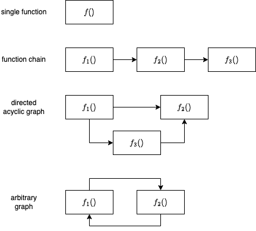

<a name="readme-top"></a>
# EDGELESS Reference Implementation

<div align="center">

  

  [![Contributors][contributors-shield]][contributors-url]
  [![Forks][forks-shield]][forks-url]
  [![Stargazers][stars-shield]][stars-url]
  [![Issues][issues-shield]][issues-url]
  <!-- [![MIT License][license-shield]][license-url] -->
  <!-- [![LinkedIn][linkedin-shield]][linkedin-url] -->

[Report an error](https://github.com/edgeless-project/edgeless/issues/new?template=bug_report.yaml) · [Request a feature](https://github.com/edgeless-project/edgeless/issues/new?template=feature_request.yaml) · [Ask us a question](https://github.com/edgeless-project/edgeless/issues/new?template=question.yaml)
</div>


This repository contains a research prototype of the EDGELESS platform, which is
under active development within the [EDGELESS project](https://edgeless-project.eu/).
EDGELESS is a framework that enables _serverless edge computing_, which is
intended especially for edge nodes with limited capabilities.

> [!NOTE]
> There currently are no guarantees on Stability and API-Stability!

[Repository layout](repository_layout.md)
<details>
<summary>Table of Contents</summary>

- [EDGELESS Reference Implementation](#edgeless-reference-implementation)
  - [Architecture Overview](#architecture-overview)
  - [Key Concepts](#key-concepts)
      - [*workflows*](#workflows)
      - [*functions*](#functions)
      - [*resources*](#resources)
  - [Next steps](#next-steps)
  - [Quickstart](#quickstart)
    - [1. Build EDGELESS binaries](#1-build-edgeless-binaries)
    - [2. Run them](#2-run-them)
  - [Known limitations](#known-limitations)
  - [Contributing](#contributing)
  - [License](#license)
  - [Funding](#funding)
</details>

## Architecture Overview

An EDGELESS cluster consists of one or more _orchestration domains_ (one in
the example figure below), managed by an **ε-CON** (controller).

An orchestration domain is made up of:

- **1 ε-ORC** (orchestrator) that manages the scaling of function instances and
  resources within its domain;
- **1 ε-BAL** (balancer) that plays two roles:
  1) realization of an inter-domain data plane, to allow events generated by a
  function instance in an orchestration domain to be consumed by a function
  instance in another orchestration domain;
  1) configuration and management of the resources;
- **$\ge$ 1 nodes**, which can host the execution of the function instances of a
  given workflow, either within a [WebAssembly](https://webassembly.org/) run-time 
  environment or inside a [Docker container](container-runtime.md).


## Key Concepts

> [!WARNING]
> These concepts require moderate knowledge of what serverless computing is and how it works.

#### *workflows*

Users in EDGELESS interact with the cluster's ε-CON to request the creation of _workflows_.
A workflow specifies how a set of ***functions*** and ***resources*** should interact
with one another to compose the service requested by the user, by sending
_asynchronous events_ to each other that are akin to function invocations.

The e-CON proceeds to assign the requested functions and resources to the ε-ORCs
of the *orchestration domains* it controls, and the ε-ORCs deploy the *function* and *resource instances*
to its nodes in order to provide the best QoS.

EDGELESS _functions_ live entirely within the realm of the EDGELESS run-time, while
_resources_ are capable of interacting with the external environment, e.g. handling events
in a resource may have a side effect, such as updating an entry in an external
in-memory database or reading the value of a physical sensor.


#### *functions*

EDGELESS *functions* are **<u>stateful</u>**: a given *function instance* is assigned to exactly one
workflow, thus the *function developer* may assume that data will generally
remain available across multiple invocations of the same *function instance*.
However such state is:

- 🔒 **tied to the specific instance**: if there are multiple *function instances* for the same
*function*, then there is no guarantee of consistency across the multiple states.
- ⌛ **ephemeral**: if a function instance is terminated, there is no effort to
save/persist the state.

Furthermore, unlike in many other serverless computing platforms, *workflows* may
consist of a wide variety of *function* compositions, as illustrated below.



The byte code of the WASM *function instance* or the name of the Docker
container to be started is provided by the user when requesting
the creation of a *workflow*, which also includes *annotations* to specify the
Quality of Service requirements (e.g. maximum completion time) and *workload
characteristics* (e.g. average invocation rate), as well as the function's affinity
to specific hardware properties (e.g. GPU required) or preference
for other system parameters (e.g. location, owner, price).
Depending on the annotations, the set of active *workflows* and the current
system conditions, the ε-CON may reject the *workflow* creation request.

#### *resources*

When a node is registered into an *orchestration domain*, its configuration exposes
both the hardware it wants to commit to EDGELESS, and the *resource providers*
it can host. The only limitation is that a node can only have one resource of each type.

The resource provider uuid in the configuration has a double purpose:

- if empty, then the resource provider is not created;
- otherwise, it is created and that's the identifier used.

The resource provider ID is used by the ε-ORC to identify the resource
providers, thus their names must be unique within an orchestration domain.
When deploying workflows, users can request that a resource instance is created
on a given resource provider using the `resource_match_all` annotation.
Imagine for instance that a resource provider is a digital twin for a physical
resource, e.g., a camera: it would very important for the user to be able to
identify precisely that resource provider.

The resource providers currently shipped with EDGELESS are reported in the table
below.

| Type           | Description                                                                              | Node configuration                                             | Run-time configuration                                             | Example                                  |
| -------------- | ---------------------------------------------------------------------------------------- | -------------------------------------------------------------- | ------------------------------------------------------------------ | ---------------------------------------- |
| `dda`          | Interact with a [Data Distribution Agent](https://github.com/coatyio/dda)                | dda_url, dda_provider                                          | dda_url, dda_com_subscription_mapping, dda_com_publication_mapping | [click](examples/dda_demo/README.md)     |
| `file-log`     | Save log lines to a node-local file                                                      | file_log_provider                                              | filename, add-timestamp                                            | [click](examples/file_log/README.md)     |
| `http-egress`  | Execute HTTP commands on external web servers                                            | http_egress_provider                                           |                                                                    | [click](examples/http_egress/README.md)  |
| `http-ingress` | Ingest HTTP commands from external web clients                                           | http_ingress_provider, http_ingress_url                        | host, methods                                                      | [click](examples/http_ingress/README.md) |
| `kafka-egress` | Send a message to an external [Apache Kafka](https://kafka.apache.org/) server           | kafka_egress_provider (requires `rdkafka` feature)             | brokers, topic                                                     | [click](examples/kafka_egress/README.md) |
| `ollama`       | Interact via an LLM ChatBot deployed on an external [ollama](https://ollama.com/) server | host, port, messages_number_limit, provider (separate section) | model                                                              | [click](examples/ollama/README.md)       |
| `redis`        | Update a value on an external [Redis](https://redis.io/) server                          | redis_provider                                                 | url, key                                                           | [click](examples/redis/README.md)        |

With `edgeless_node_d --available-resources` you can find the list of resource
providers that a node supports, along with the version, output channels, and
configuration parameters for each resource provider.

## Next steps

For a deeper insight on the functioning and architecture of EDGELESS, please refer to the following specific documentation:
- [Orchestration model](orchestration.md)
- [Support of Docker containers](container-runtime.md)
- [A step-by-step guide to deploying a minimal EDGELESS system](deploy_step_by_step.md)
- [How to create a new function](rust_functions.md)
  ([YouTube tutorial](https://youtu.be/1JnQIM9VTLk?si=o34YKRRJXNz0H54f))
- [How to compose a new workflow](workflows.md)
  ([YouTube tutorial](https://youtu.be/kc4Ku5p5Nrw?si=ZRxx0kmsIuAYLie1))
- [Examples shipped with the repository](../examples/README.md)


## Quickstart
TODO: Probably move to anywhere else

### 1. Build EDGELESS binaries

See [building instructions](building.md).

### 2. Run them

It is recommended that you enable at least info-level log directives with:

```
export RUST_LOG=info
```

To get the basic system running, first create the default configuration files
(they have fixed hardcoded values):

```
target/debug/edgeless_inabox -t 
target/debug/edgeless_cli -t cli.toml
```

which will create:

- `balancer.toml`
- `controller.toml`
- `node.toml`
- `orchestrator.toml`
- `cli.toml`

Then you can run the **EDGELESS-in-a-box**, which is a convenience binary that
runs every necessary component as one, using the generated configuration files:

```
target/debug/edgeless_inabox
```

Congratulations 🎉 now that you have a complete EDGELESS system you may want to check the the `examples/` directory, which contains several workflows/functions that are representative of the current EDGELESS features.

You can find [here](examples/README.md) the full list with a short description of each.

## Known limitations

Currently there are several known limitations, including the following ones:

- the dataplane is limited within a single orchestration domain and realized
  through a full-mesh interconnection between all the nodes;
- the ε-BAL is a mere skeleton with no logic;
- the ε-CON only supports a single orchestration domain and does not perform
  any kind of admission control;
- no workflow-level annotations are supported; 
- the payload of events is not encrypted;
- the configuration of the ε-CON is read from a file and cannot be modified
  (e.g., it is not possible to add an orchestration domain);
- there is no persistence of the soft states of the various components.

The full list of issues is tracked on
[GitHub](https://github.com/edgeless-project/edgeless/issues).

Stay tuned (star & watch [the GitHub project](https://github.com/edgeless-project/edgeless))
to remain up to date on future developments.

## Contributing

We love the open source community of developers ❤️ and we welcome contributions to EDGELESS.

The [contributing guide](../CONTRIBUTING_GUIDE.md) contains some rules you should adhere to when contributing to this repository.

## License

The Repository is licensed under the MIT License. Please refer to
[LICENSE](../LICENSE) and [CONTRIBUTORS.txt](../CONTRIBUTORS.txt). 

## Funding

EDGELESS received funding from the [European Health and Digital Executive Agency
 (HADEA)](https://hadea.ec.europa.eu/) program under Grant Agreement No 101092950.

<p align="right"><a href="#readme-top">Back to top&#x1F53C;</a></p>

<!-- Urls, Shields and Badges -->
[contributors-shield]: https://img.shields.io/github/contributors/edgeless-project/edgeless.svg?style=for-the-badge
[contributors-url]: https://github.com/edgeless-project/edgeless/graphs/contributors
[forks-shield]: https://img.shields.io/github/forks/edgeless-project/edgeless.svg?style=for-the-badge
[forks-url]: https://github.com/edgeless-project/edgeless/network/members
[stars-shield]: https://img.shields.io/github/stars/edgeless-project/edgeless.svg?style=for-the-badge
[stars-url]: https://github.com/edgeless-project/edgeless/stargazers
[issues-shield]: https://img.shields.io/github/issues/edgeless-project/edgeless.svg?style=for-the-badge
[issues-url]: https://github.com/edgeless-project/edgeless/issues
<!-- TODO: -->
[linkedin-shield]: https://img.shields.io/badge/-LinkedIn-black.svg?style=for-the-badge&logo=linkedin&colorB=555
[linkedin-url]: https://www.linkedin.com/company/itisuma/
[license-shield]: https://
[license-url]: https://