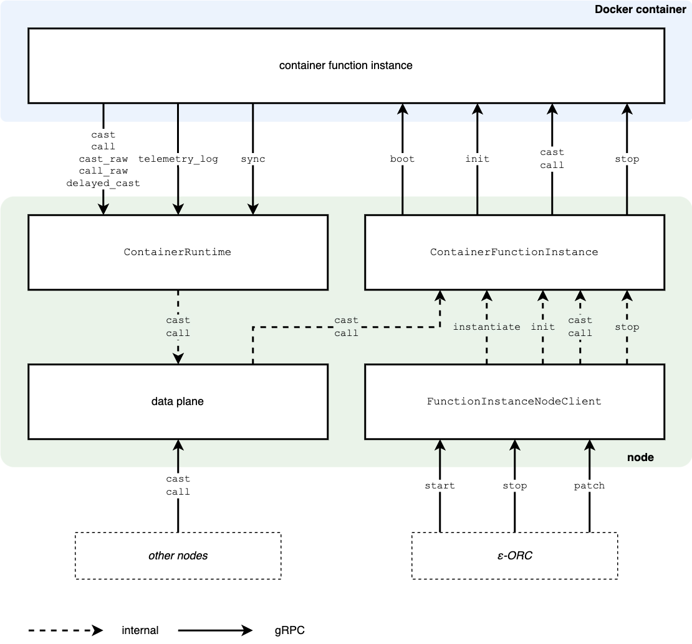
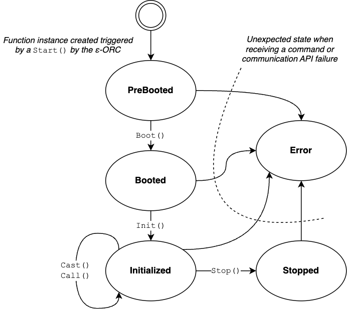

# Container runtime

EDGELESS supports multiple runtimes that can coexist in the same orchestration domain and also in the same node.
Currently, two runtimes are implemented:

1. A _WebAssembly runtime_, which can be specified by setting the `function_type` to `RUST_WASM` in the function specification within a workflow
2. A _container runtime_, which uses `CONTAINER` as `function_type` in the function specification and is illustrated below.

## Architecture and interfaces

The architecture of the container runtime is illustrated in the figure below.



The container function instance interacts via gRPC with the node through the interfaces `GuestAPIFunction` (as server) and `GuestAPIHost` (as client), whose methods are describe below.

Within the node, the two components for handling container function instances are:

- `ContainerRuntime`, which hosts the gRPC server interacting with all the active container function instances and is responsible for collecting the remote methods they call
- `ContainerFunctionInstance`, which implements the container-specific logic of the function instance, thus complementing the runtime-agnostic capabilities provided elsewhere

The [rs_docker library](https://gitlab.com/kblobr/rust-docker) is used to interact with a local Docker that must be installed and running on the same host as `edgeless_node`.

### GuestAPIFunction

| Method | Description                                        | Input                                             | Output       |
| ------ | -------------------------------------------------- | ------------------------------------------------- | ------------ |
| Boot   | Create the function instance                       | End-point of the GuestAPIHost                     | --           |
| Init   | Initialize the function instance                   | Payload and saved state of the function instance  | --           |
| Cast   | Invoke the function instance (asynchronous)        | Source instance identifier and function arguments | --           |
| Call   | Invoke the function instance and wait for a return | Source instance identifier and function arguments | Return value |
| Stop   | Clean up the function instance before termination  | --                                                | --           |

### GuestAPIHost

| Method       | Description                                                                                 | Input                                                         | Output       |
| ------------ | ------------------------------------------------------------------------------------------- | ------------------------------------------------------------- | ------------ |
| Cast         | Generate an asynchronous event                                                              | Destination (alias) and payload of the event generated        | --           |
| CastRaw      | Generate an asynchronous event on a specific function instance                              | Destination and payload of the event generated                | --           |
| Call         | Generate a synchronous event for which a return is expected                                 | Destination (alias) and payload of the event generated        | Return value |
| CallRaw      | Generate a synchronous event for which a return is expected on a specific function instance | Destination and payload of the event generated                | Return value |
| TelemetryLog | Generate a telemetry log event                                                              | Data to be logged                                             | --           |
| DelayedCast  | Generate an asynchronous event at a later time                                              | Delay, destination (alias) and payload of the event generated | --           |
| Sync         | Synchronize distributed state                                                               | State to be synchronized                                      | --           |

### Sequence of operation

The function instance is created by the node upon receiving a `start` command from the ε-ORC.
This causes an `instantiate` command to be issued on the `ContainerFunctionInstance`, which will trigger the start of the container whose image:version is indicated in the function specification, followed by the `boot` command on the gRPC server hosted by the container itself.
The latter will inform the container function instance of the URL of the node that offers the `GuestAPIHost` API.

The other commands, that is `cast` and `call` from the dataplane and `stop` from the ε-ORC, are passed to the `ContainerFunctionInstance` module, which forwards them to the function instance in the container via the respective gRPC methods.
After `stop`, the container is destroyed.

## Usage

### On the node

The container runtime must be enabled in the `[container_runtime]` section of the TOML configuration file of `edgeless_node`, e.g.:


```ini
[container_runtime]
enabled = true
guest_api_host_url = "http://10.0.0.1:7100"
```

The above configuration will enable the container runtime and start a gRPC server at the specified URL to interact with the containerized function instance.
The URL must be reachable from the container.
The availability of such a runtime will be announced by the node to the ε-ORC so that the latter will be allowed to create container-based function instances on the node.

For simplicity, we currently assume that all the images that may be deployed in the node are available locally.
In other words, images are never pulled from remote servers.

### For the application developer

The application developer may request the deployment of a container function instance by crafting appropriately the function specification in their workflow.

Example of `class_specification` of a function in a workflow JSON specification:

```json
    "class_specification": {
        "id": "delay",
        "function_type": "CONTAINER",
        "version": "0.1",
        "code": "container:edgeless_function:latest",
        "outputs": []
    },
```

The `id`, `version`, and `outputs` are the same as for all the runtimes, whereas:

- `function_type` must be set to `CONTAINER`
- `code` must be set to the string `container:` followed by the image name and version of the container (recall that the image with that version must be available on the node)

### For the function developer

Any programming language or set of libraries can be used to build the container image of a function, with the following requirements:

1. A gRPC server must be started as soon as the container starts and the port must be exposed to Docker. Such a gRPC server must implement the `GuestAPIFunction` service, which will allow the node to perform the boot/initialization/termination sequences and to call/cast events.
2. The container must be prepared to interact as client with a gRPC server running on the node adopting the `GuestAPIHost` API. This will allow the function instance to call/cast events and perform other methods (sync, telemetry_log).

Even if this is not a requirement, in EDGELESS function instances are assumed to be used to execute single-purpose and reactive computations, which are then composed in complex services as workflows.
Therefore, the function developer should avoid implementing multiple features in the same function and having background operations that are not performed in reaction to call/cast events.

We provide two templates to develop container functions:
- A template in Rust is available in this repository in the `edgeless_container_function` crate.
- A template in Python is available in 
[a separate repository](https://github.com/edgeless-project/runtime-python)
  
In both cases, the function performs a basic logic to react to incoming events.
This is merely intended to showcase the possibilities offered to the developer by EDGELESS.

The diagram below shows the finite state machine implemented in both the container function templates.

