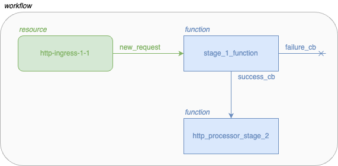

# EDGELESS workflows

From a workflow-developer perspective, workflows can be defined using a
`workflow.json` file. Internally, the `edgeless_cli` uses the
`WorkflowInstanceAPI` to start/stop workflows. As they are rather similar, we
will focus on the `workflow.json` format here. Take a look at an example
workflow configuration (don't worry, we will explain what the different names
mean in more detail further down).

## Example Workflow Instance Configuration

```json
{
    "functions": [
        {
            "name": "stage_1_function", // logical name, local to this workflow
            "class_specification": { // uniquely identifies a function
                "id": "http_processor",
                "function_type": "RUST_WASM",
                "version": "0.1",
                "code": "./compiled_function.wasm",
                "outputs": ["success_cb", "failure_cb"] 
            },
            "output_mapping": { // defines a mapping of output channels to logical names of functions/resources in this workflow
                "success_cb": "http_processor_stage_2",
                "failure_cb": // unmapped, events generated are ignored
            },
            "annotations": {}
        },
        {
            "name": "http_processor_stage_2",
            "class_specification": {
                "id": "http_processor2",
                "function_type": "RUST_WASM",
                "version": "0.1",
                "code": "./processing_function2/http_processor2.wasm",
                "outputs": []
            },
            "output_mapping": {},
            "annotations": {}
        },
    ],
    "resources": [
        {
            "name": "http-ingress-1-1",
            "class_type": "http-ingress",
            "output_mapping": {
                "new_request": "stage_1_function" 
            },
            "configurations": { // resource-specific configuration
                "host": "edgeless-project.eu",
                "methods": "POST"
            }
        }
    ],
    "annotations": {}
}
```

A Workflow Instance Configuration as the one shown above contains four main
elements:

* The list of logical functions used by this workflow (`functions`), which 
  will be mapped to physical function instances running one edge-cloud nodes.
* The list of resources used by this workflow (`resources`). The resources 
  are special functions which are identified by their names within an 
  EDGELESS system and interact with the environment.
* The workflow annotations, which define the service level objectives, 
  requirements, and workload characteristics.

A Function Instance Definition (two of them are shown in the example above)
contains the following elements:

* The `name` identifies the logical function within the scope of this
  workflow.
* Information about the function class (`class_specification`):
    * `id`, `version`, and `function_type` uniquely identify the function,
      similar to what happens with docker containers, this can be used to
      fetch the function from a repository.
    * `code` specifies the location on the local filesystem
      of the client of the WebAssembly bytecode that contains the function
      logic
    * `outputs` specifies which output channels are used within the function
      to generate new events
* `output_mapping` defines how to map each output channel to the function
  or resource that will handle it. An output channel can be left unspecified,
  in which case events generated by the function on that channel are ignored.
* The function annotations, which define the the service level objectives 
  and requirements of the function. Currently supported annotations:
  * `init-payload`: the content is passed to the `handle_init()` method of the
  function instance upon construction (it is akin to the arguments of a
  constructor in object-oriented programming languages);
  * `max_instances`: maximum number of function instances that can be spawned
  by the ε-ORC. 0 means unlimited;
  * `node_id_match_any`: the function instance must be created on a node
  matching one of the given UUIDs, if any is given;
  * `label_match_all`: the function instance must be created on a node that
  matches all the labels specified, if any is given.
  * `resource_match_all`: the function instance must be created on a node that
  hosts all the resources providers specified, if any is given.
  * `tee`: if `"required"` then the function instance must be created on a node
  that is running in a Trusted Execution Environment.
  * `tpm`: if `"required"` then the function instance must be created on a node
  that has a Trusted Platform Module.

A Resource Instance Definition (one of them is shown above) contains the
following elements:

* The `name` identifies the resource to be started for the execution of
  this workflow.
* The `class_type` defines which type of resource must be instantiated.
  Compared to the functions that are not known to the controller unless
  instantiated, the resource providers register themselves and their resource
  classes directly with the controller.
* `output_mapping` defines how to map each output channel to the function
  or resource that will handle it. This is analogous to the same field
  in functions.
* The configuration of the resource instance (`configurations`). Each
  resource requires a specific set of key-values. For instance, the
  `http-ingress` resource shown in the example needs the host name
  and type of HTTP command to match the incoming requests.

The example above shows a workflow consisting of an http-ingress and two
processing functions.
When a new request matching the configuration is received
by the ingress, it sends an event to the `stage_1_function` function as
this is configured in the (http-ingresses') resource's
`output_mapping` (specified under `new_request`). This function
subsequently sends a specific set of events (`success_cb`) towards the
`http_processor_stage_2` function.

A graphical representation of the example workflow above follows:

