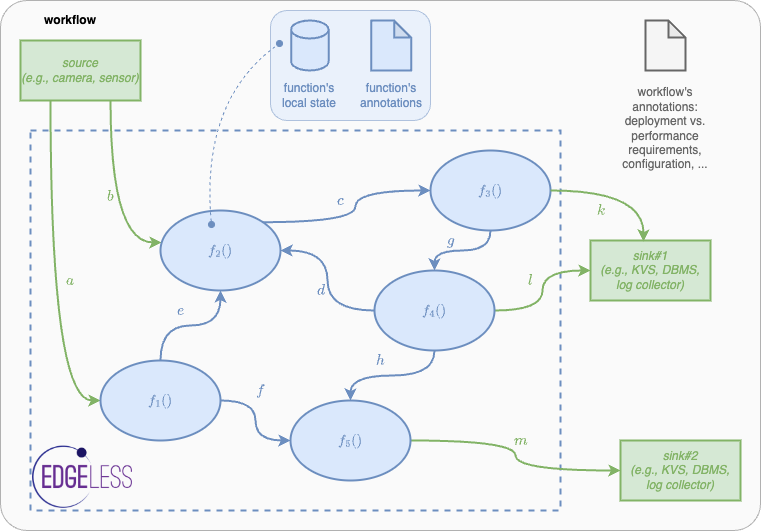
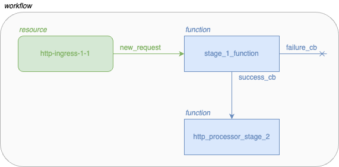

# Basic concepts in EDGELESS

In this document we define the basic concepts of workflows, resources, and
functions, and then we describe how to encode a workflow specification in JSON.

## Workflows

Users interact with the ε-CON to request the creation of _workflows_.
A workflow specifies how a number of functions and resources should interact
with one another to compose the service requested by the user by sending to one
another _asynchronous events_ that are akin to function invocations.
_Functions_ live entirely within the realm of the EDGELESS run-time, while
_resources_ may interact with the external environment, e.g., handling events
in a resource may have a side effect, such as updating an entry on an external
in-memory database or reading the value of a physical sensor.



## Resources

Following their configuration fiels, EDGELESS nodes can host one or more
resource providers, but a node cannot have more than one resource of a given
type.
The resource provider ID in the configuration has a double purpose:

- if empty, then the resource provider is not created;
- otherwise, it is created and that's the identifier used.

The resource provider ID is used by the ε-ORC to identify the resource
providers, thus their names must be unique within an orchestration domain.
When deploying workflows, users can request that a resource instance is created
on a given resource provider using the `resource_match_all` annotation.
Imagine for instance that a resource provider is a digital twin for a physical
resource, e.g., a camera: it would very important for the user to be able to
identify precisely that resource provider.

The resource providers currently shipped with EDGELESS are reported in the table
below.

| Type           | Description                                                                              | Node configuration                                             | Run-time configuration                                             | Example                                     |
| -------------- | ---------------------------------------------------------------------------------------- | -------------------------------------------------------------- | ------------------------------------------------------------------ | ------------------------------------------- |
| `dda`          | Interact with a [Data Distribution Agent](https://github.com/coatyio/dda)                | dda_provider                                                   | dda_url, dda_com_subscription_mapping, dda_com_publication_mapping | [click](../examples/dda_demo/README.md)     |
| `file-log`     | Save log lines to a node-local file                                                      | file_log_provider                                              | filename, add-source-id, add-timestamp                             | [click](../examples/file_log/README.md)     |
| `http-egress`  | Execute HTTP commands on external web servers                                            | http_egress_provider                                           |                                                                    | [click](../examples/http_egress/README.md)  |
| `http-ingress` | Ingest HTTP commands from external web clients                                           | http_ingress_provider, http_ingress_url                        | host, methods                                                      | [click](../examples/http_ingress/README.md) |
| `kafka-egress` | Send a message to an external [Apache Kafka](https://kafka.apache.org/) server           | kafka_egress_provider (requires `rdkafka` feature)             | brokers, topic                                                     | [click](../examples/kafka_egress/README.md) |
| `ollama`       | Interact via an LLM ChatBot deployed on an external [ollama](https://ollama.com/) server | host, port, messages_number_limit, provider (separate section) | model                                                              | [click](../examples/ollama/README.md)       |
| `redis`        | Perform SET and GET operations on a [Redis](https://redis.io/) server                    | redis_provider                                                 | url, key                                                           | [click](../examples/redis/README.md)        |
| `sqlx`         | Perform operations on an SQLite database                                                 | sqlx_provider                                                  | url                                                                | [click](../examples/sqlx/README.md)         |
| `serverless`   | Call an external [OpenFaaS](https://www.openfaas.com/)-compatible function at an URL     | class_type, version, function_url, provider (separate section) |                                                                    | [click](../examples/serverless/README.md)   |

With `edgeless_node_d --available-resources` you can find the list of resource
providers that a node supports, along with the version, output channels, and
configuration parameters for each resource provider.

## Functions

Functions are _stateful_: a given function instance is assigned to exactly one
workflow, thus the function developer may assume that data will generally
remain available across multiple invocations on the same function instance.
However such state is:

- tied to the specific instance: if there are multiple instances for the same
function, then there is no consistency guarantee across the multiple states;
- ephemeral: if a function instance is terminated, then there is no effort to
save/persist the state.

Furthermore, unlike many other serverless computing platforms, workflows may
consist of a wide variety of function compositions, as illustrated below.


The byte code of the WASM function instance or the name of the Docker
container to be started is provided by the user when requesting
the creation of a workflow, which also includes _annotations_ to specify the
Quality of Service requirements (e.g., maximum completion time) and workload
characteristics (e.g, average invocation rate), as well as affinity of
functions to specific hardware properties (e.g., GPU required) or preference
for other system parameters (e.g., location, owner, price).
Depending on the annotations, the set of active workflows, and the current
system conditions, the ε-CON may reject the workflow creation request.

## JSON specification

Clients can specify the composition of a workflow via JSON files, which can
be loaded by `edgeless_cli`, including three sections:

* The list of logical functions used by this workflow (`functions`), which 
  will be mapped to physical function instances running one edge-cloud nodes.
* The list of resources used by this workflow (`resources`). The resources 
  are special functions which are identified by their names within an 
  EDGELESS system and interact with the environment.
* The workflow annotations, which define the service level objectives, 
  requirements, and workload characteristics -- currently not supported.

Functions contain the following elements:

* The `name` identifies the logical function within the scope of this
  workflow.
* Information about the function class (`class_specification`):
    * `id`, `version`, and `function_type` uniquely identify the function,
      similar to what happens with docker containers, this can be used to
      fetch the function from a repository.
    * `code` specifies the location on the local filesystem
      of the client of the WebAssembly bytecode that contains the function
      logic
    * `outputs` specifies which output channels are used within the function
      to generate new events
* `output_mapping` defines how to map each output channel to the function
  or resource that will handle it. An output channel can be left unspecified,
  in which case events generated by the function on that channel are ignored.
* The function annotations, which define the the service level objectives 
  and requirements of the function. Currently supported annotations:
  * `init-payload`: the content is passed to the `handle_init()` method of the
  function instance upon construction (it is akin to the arguments of a
  constructor in object-oriented programming languages);
  * `max_instances`: maximum number of function instances that can be spawned
  by the ε-ORC. 0 means unlimited;
  * `node_id_match_any`: the function instance must be created on a node
  matching one of the given UUIDs, if any is given;
  * `label_match_all`: the function instance must be created on a node that
  matches all the labels specified, if any is given.
  * `resource_match_all`: the function instance must be created on a node that
  hosts all the resources providers specified, if any is given.
  * `tee`: if `"required"` then the function instance must be created on a node
  that is running in a Trusted Execution Environment.
  * `tpm`: if `"required"` then the function instance must be created on a node
  that has a Trusted Platform Module.

Resources contain the following elements:

* The `name` identifies the resource to be started for the execution of
  this workflow.
* The `class_type` defines which type of resource must be instantiated.
  Compared to the functions that are not known to the controller unless
  instantiated, the resource providers register themselves and their resource
  classes directly with the controller.
* `output_mapping` defines how to map each output channel to the function
  or resource that will handle it. This is analogous to the same field
  in functions.
* The configuration of the resource instance (`configurations`). Each
  resource requires a specific set of key-values. For instance, the
  `http-ingress` resource shown in the example needs the host name
  and type of HTTP command to match the incoming requests.

The example above shows a workflow consisting of an http-ingress and two
processing functions.
When a new request matching the configuration is received
by the ingress, it sends an event to the `stage_1_function` function as
this is configured in the (http-ingresses') resource's
`output_mapping` (specified under `new_request`). This function
subsequently sends a specific set of events (`success_cb`) towards the
`http_processor_stage_2` function.

### Example

For example, we report below the JSON encoding of the following workflow.




```json
{
    "functions": [
        {
            "name": "stage_1_function", // logical name, local to this workflow
            "class_specification": { // uniquely identifies a function
                "id": "http_processor",
                "function_type": "RUST_WASM",
                "version": "0.1",
                "code": "./compiled_function.wasm",
                "outputs": ["success_cb", "failure_cb"] 
            },
            "output_mapping": { // defines a mapping of output channels to logical names of functions/resources in this workflow
                "success_cb": "http_processor_stage_2",
                "failure_cb": // unmapped, events generated are ignored
            },
            "annotations": {}
        },
        {
            "name": "http_processor_stage_2",
            "class_specification": {
                "id": "http_processor2",
                "function_type": "RUST_WASM",
                "version": "0.1",
                "code": "./processing_function2/http_processor2.wasm",
                "outputs": []
            },
            "output_mapping": {},
            "annotations": {}
        },
    ],
    "resources": [
        {
            "name": "http-ingress-1-1",
            "class_type": "http-ingress",
            "output_mapping": {
                "new_request": "stage_1_function" 
            },
            "configurations": { // resource-specific configuration
                "host": "edgeless-project.eu",
                "methods": "POST"
            }
        }
    ],
    "annotations": {}
}
```