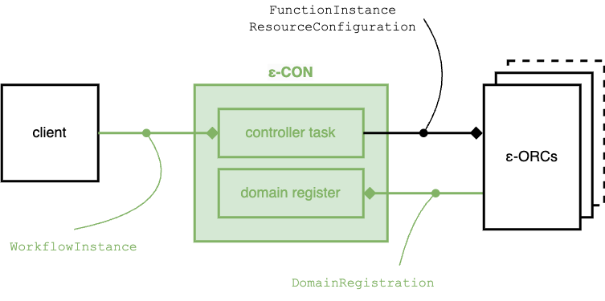

# EDGELESS controller (ε-CON)

|                        |                   |
| ---------------------- | ----------------- |
| Executable name        | `edgeless_con_d`  |
| Default conf file name | `controller.toml` |

The ε-CON is the component that manages an EDGELESS cluster.
It has the following main responsibilities:

1. **Cluster formation**: it offers a `DomainRegistration` API through which
   ε-ORCs may register their respective orchestration domains, also notifying
   their capabilities (e.g., the number of nodes and the cumulative amount
   of computing resources available). ε-ORCs refresh periodically their
   registration with the ε-CON, also indicating a deadline by which a lack of
   refresh should be considered as a failure.
2. **Client portal**: the ε-CON is the entry point for clients to manage the
   lifecycles of workflows and to inspect cluster-level information, such
   as the domain availables and their capabilities and the set of active flows.
3. **Cluster orchestration**: when a client requests the creation of a workflow,
   the ε-CON checks if the deployment requirements of all the functions and
   resources of the workflow are met by at least one domain. If multiple such
   domains are available, then the target domain is selected at random. If no
   domain is available with sufficient capabilities, then the workflow is
   rejected.
   - Once a workflow is accepted, the ε-CON is responsible for
   continuously meeting the deployment requirements: if the hosting domain
   disconnects or its capabilities change, then the ε-CON may migrate the
   workflow to another domain or, if none are available, keep it in stand-by
   until the conditions allow it to be deployed again.
   - It is also possible for a client to trigger the migration of a workflow
   from its current domain to a target one.

The ε-CON has the following interfaces, also illustrated in the diagram below:

| Interface          | Configuration file URL |
| ------------------ | ---------------------- |
| WorkflowInstance   | `controller_url`       |
| DomainRegistration | `domain_register_url`  |

The ε-CON saves the information on the active workflows on a local file,
specified in the configuration, which is loaded upon the next start of the
service.