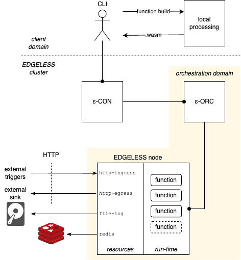

- [A step-by-step guide to deploying a minimal EDGELESS system](#a-step-by-step-guide-to-deploying-a-minimal-edgeless-system)
  - [Prerequisites](#prerequisites)
  - [EDGELESS overview](#edgeless-overview)
  - [Deploying a minimal EDGELESS cluster](#deploying-a-minimal-edgeless-cluster)
    - [Deploying the controller (ε-CON)](#deploying-the-controller-ε-con)
    - [Deploying the orchestrator (ε-ORC)](#deploying-the-orchestrator-ε-orc)
    - [Deploying a node](#deploying-a-node)
  - [Building and executing a simple function](#building-and-executing-a-simple-function)
  - [Where to go next](#where-to-go-next)

# A step-by-step guide to deploying a minimal EDGELESS system

In this guide, we will:

1. Provide a basic overview of EDGELESS.
2. Deploy a minimal EDGELESS cluster, with a controller (ε-CON), an orchestrator (ε-ORC), and a node with WebAssembly runtime
3. Build a function that does nothing and deploy it as a workflow through the EDGELESS CLI

## Prerequisites

In the following, you will need to download a local copy of the [EDGELESS core repository](https://github.com/edgeless-project/edgeless) and compile the executables, as illustrated in the [building guide](building.md).

Before proceeding, make sure that you have the following executables, which will be used in this guide and should be under `target/debug/` from the repository root.

| Executable name   |
| ----------------- |
| `edgeless_con_d`  |
| `edgeless_orc_d`  |
| `edgeless_node_d` |
| `edgeless_cli`    |

## EDGELESS overview

EDGELESS has a three-tier hierarchical architecture: computation nodes are grouped into orchestration domains, which participate in clusters, which may interact with one another.
The minimal EDGELESS system, therefore, consists of a single cluster with one orchestration domain hosting just one node, as illustrated in this picture:



The picture also shows a user, who uses the CLI to locally build the WebAssembly bytecode of their functions and interact with the ε-CON for the creation of _workflows_.
A workflow is a directed graph of abstractions that perform actions by reacting to events, with associated annotations that define the characteristics and requirements of the application/service associated with the workflow.
A workflow is identified through its UUID, assigned upon creation.

An EDGELESS node offers two types of abstractions:

- _Functions_, which only interact with other EDGELESS abstractions, through consuming and generating events dispatched by an underlying data plane. During the workflow's lifetime, a function, which is a logical entity, materializes into one or more function instances consisting of WebAssembly applications running in the node's runtime environment. 
- _Resources_, which can interact with both other EDGELESS abstractions through events and the outside world. Resources are started by _providers_ on demand as part of the workflow creation procedure. The figure above shows a node providing four types of resources: a source of HTTP events and three sinks of events towards an external web server, a local file, and a Redis in-memory KVS.

Both functions and resources are identified within a workflow through their names.

## Deploying a minimal EDGELESS cluster

Before starting:

- Below we prepend `RUST_LOG=info` to all the executions.
This makes the output more verbose than usual and it is convenient to see what is happening underneath.
- We assume that the current working directory is `target/debug` or any other path that contains the executables used in this guide, make sure you move there with, e.g., `cd target/debug/`.
- All the executables used in this guide require a [TOML](https://toml.io/en/) configuration file, according to the table below. A default template can be generated with the `-t` command-line option, followed by the name of the output configuration file.

| Command           | Default configuration file |
| ----------------- | -------------------------- |
| `edgeless_con_d`  | `controller.toml`          |
| `edgeless_orc_d`  | `orchestrator.toml`        |
| `edgeless_node_d` | `node.toml`                |
| `edgeless_cli`    | `cli.toml`                 |

### Deploying the controller (ε-CON)

In one shell, create the default configuration of the ε-CON:

```bash
./edgeless_con_d -t controller.toml
```

The configuration file is the following:

```toml
controller_url = "http://127.0.0.1:7001"
orchestrators = [
    { domain_id = "domain-1", orchestrator_url="http://127.0.0.1:7011" }
```

and it contains the URL exposed by the ε-CON towards the client (port 7001) and the map of its orchestration domains, identified by their name and URL of the ε-ORC (not yet deployed).

Then, deploy the ε-CON:

```bash
RUST_LOG=info ./edgeless_con_d
```

This will show the following output:

```
Starting Edgeless Controller at http://127.0.0.1:7001
```

and the process will remain waiting for more action.


### Deploying the orchestrator (ε-ORC)

In another shell, create the default configuration of the ε-ORC:

```bash
./edgeless_orc_d -t orchestrator.toml
```

The configuration file is the following:

```toml
[general]
domain_id = "domain-1"
orchestrator_url = "http://127.0.0.1:7011"
orchestrator_url_announced = ""
agent_url = "http://127.0.0.1:7121"
agent_url_announced = ""
invocation_url = "http://127.0.0.1:7102"
invocation_url_announced = ""

[baseline]
orchestration_strategy = "Random"
keep_alive_interval_secs = 2

[proxy]
proxy_type = "None"
redis_url = ""

[collector]
collector_type = "None"
redis_url = ""
```

and it contains the domain name and URL exposed by the orchestrator (note: they _must_ be the same as those in `controller.toml`) and the orchestrator basline configuration, with the strategy to be used (can be one of Random or RoundRobin) and the keep-alive interval before a node is automatically deregistered.
The `[proxy]` and `[collector]` sections are explained in [orchestration guide](./orchestration.md); the related features are disabled by default.

Then, deploy the ε-ORC:

```bash
RUST_LOG=info ./edgeless_orc_d
```

This will show an output containing (among other lines) the following:

```
Starting Edgeless Orchestrator at http://127.0.0.1:7011
node keep-alive enabled every 2 seconds
Orchestration logic strategy: random
Start OrchestratorAPIServer GRPC Server at http://127.0.0.1:7011
```

and this process, too, will remain waiting for more action.

### Deploying a node

In another shell, create the default configuration of the node:

```bash
./edgeless_node_d -t node.toml
```

The configuration file is the following (`node_id` is random and will
_almost certainly_ be different for you)):

```toml
[general]
node_id = "fda6ce79-46df-4f96-a0d2-456f720f606c"
agent_url = "http://127.0.0.1:7021"
agent_url_announced = ""
invocation_url = "http://127.0.0.1:7002"
invocation_url_announced = ""
metrics_url = "http://127.0.0.1:7003"
orchestrator_url = "http://127.0.0.1:7011"

[wasm_runtime]
enabled = true

[container_runtime]
enabled = false
guest_api_host_url = ""

[resources]
http_ingress_url = "http://127.0.0.1:7035"
http_ingress_provider = "http-ingress-1"
http_egress_provider = "http-egress-1"
file_log_provider = "file-log-1"
redis_provider = "redis-1"

[user_node_capabilities]
num_cpus = 40
model_name_cpu = "Intel(R) Xeon(R) Silver 4410T"
clock_freq_cpu = 2971
num_cores = 1
mem_size = 0
labels = []
is_tee_running = false
has_tpm = false
```

and it contains:
- in the `[general]` section:
  - the UUID of this node, which must be unique within the orchestration domain
  - some URLs that are exposed by the node for different purposes:
    - the agent URL is used by the ε-ORC to manage the lifecycle of functions/resources hosted by this node
    - the invocation URL is used by the EDGELESS data plane to consume events addressed to function instances and resources of this node
    - the metrics URL shows telemetry data about the node run-time
  - the URL of the ε-ORC, to which this connects
- in the `[wasm_runtime]` section:
  - whether this node accepts WebAssembly function instances
- in the `[container_runtime]` section:
  - whether this node accepts Docker function instances; if yes then the
  URL of the gRPC server exposed by the node should be specified (must be
  on an address that is reachable from the containers, so it cannot be
  localhost) -- see more details in the
  [container's example documentation](../examples/container/README.md)
- in the `[resources]` section:
  - the name (and configuration, where needed) of the resource providers offered by this node; if the name is left empty, then the corresponding provider is not created; in the example all the providers are assigned a name, thus the node will offer HTTP ingress/egress, file logging, and Redis writing resources
- in the `[user_node_capabitilies]` section:
  - the values of the node capabilities that are exposed to the ε-ORC (some of)
  the values are automatically inferred when the `edgeless_node` application
  starts, but overwritten by the values specified in the configuration file,
  if any 
  - the labels assigned to this node, which can be used to force some nodes
  to be selected as candidates by the ε-ORC (see the
  [orchestration documentation](orchestration.md) for more
  details)

Then, deploy the node:

```bash
RUST_LOG=info ./edgeless_node_d
```

This will show the following output (some lines were removed for better readability):

```
Starting Edgeless Node
Start InvocationAPI GRPC Server at http://127.0.0.1:7002
Creating resource 'http-ingress-1' at http://127.0.0.1:7035
Creating resource 'http-egress-1'
Creating resource 'file-log-1'
Creating resource 'redis-1'
Starting Edgeless Runner
Starting Edgeless Agent
Start AgentAPI GRPC Server at http://127.0.0.1:7021
Registering this node 'fda6ce79-46df-4f96-a0d2-456f720f606c' on e-ORC http://127.0.0.1:7011, capabilities: 40 Intel(R) Xeon(R) Silver 4410T CPU(s) at 801 BogoMIPS, 1 core(s), 0 MB memory
this node 'fda6ce79-46df-4f96-a0d2-456f720f606c' registered to e-ORC 'http://127.0.0.1:7011'
```

Note the last two lines, which confirm that this node registered successfully to its ε-ORC, also providing the latter with information on some node capabilities, e.g., the number and type of CPUs.

After the node starts, the output of the ε-ORC updates as follows:

```
new resource advertised by node fda6ce79-46df-4f96-a0d2-456f720f606c: provider_id http-ingress-1, class_type http-ingress, outputs [new_request]
new resource advertised by node fda6ce79-46df-4f96-a0d2-456f720f606c: provider_id http-egress-1, class_type http-egress, outputs []
new resource advertised by node fda6ce79-46df-4f96-a0d2-456f720f606c: provider_id file-log-1, class_type file-log, outputs []
new resource advertised by node fda6ce79-46df-4f96-a0d2-456f720f606c: provider_id redis-1, class_type redis, outputs []
added function instance client: node_id fda6ce79-46df-4f96-a0d2-456f720f606c, agent URL http://127.0.0.1:7021, invocation URL http://127.0.0.1:7002, capabilities 40 Intel(R) Xeon(R) Silver 4410T CPU(s) at 801 BogoMIPS, 1 core(s), 0 MB memory
```

which shows that four resource providers (http-ingress-1, http-egress-1, file-log-1, and redis-1) have been added and associated with the newly created node, which also offers function execution with given capabilities.

## Building and executing a simple function

By following all the steps above you now have three shells with processes waiting for something to do.

In a fourth shell, we now proceed to starting a workflow through the CLI.

A workflow is specified by a JSON file, which lists the functions and resources used and how they interact with one another by creating _events_ on _output channels_.

The simplest workflow consists of a single function, which does not interact with any other abstraction, such as [the following](../examples/noop/workflow.json):

```json
{
    "functions": [
        {
            "name": "noop",
            "class_specification": {
                "id": "noop",
                "function_type": "RUST_WASM",
                "version": "0.1",
                "code": "../../functions/noop/noop.wasm",
                "outputs": []
            },
            "output_mapping": {},
            "annotations": {
                "init-payload": "nothing interesting"
            }
        }
    ],
    "resources": [],
    "annotations": {}
}
```

This workflow creates a function called `noop`, whose bytecode is assumed to be in the local file `noop.wasm`.

If we want to start this workflow, we must build the `noop.wasm` function first. Such a function is bundled with the EDGELESS repository [here](../functions/noop/src/lib.rs):

```rust
impl Edgefunction for NoopFunction {
    fn handle_cast(src: InstanceId, encoded_message: String) {
        log::info!("Noop casted, node {}, function {}, MSG: {}", src.node, src.function, encoded_message);
    }

    fn handle_call(src: InstanceId, encoded_message: String) -> CallRet {
        log::info!("Noop called, node {}, function {}, MSG: {}", src.node, src.function, encoded_message);
        CallRet::Noreply
    }

    fn handle_init(payload: String, _serialized_state: Option<String>) {
        edgeless_function::init_logger();
        log::info!("Noop initialized, payload: {}", payload);
    }

    fn handle_stop() {
        log::info!("Noop stopped");
    }
}
```

As can be seen, it is a mere definition of four handlers that do nothing except issue a logging directive.

These four handlers are the basic programming model of EDGELESS functions:
- `handle_cast` is called to consume an asynchronous event intended for this function instance that does not expect a return
- `handle_call` is similar but the event is synchronous, i.e., a return is expected
- `handle_init` is called upon function instance creation, to initialize the data structures, if any
- `handle_stop` is called upon function instance termination, to perform clean up procedures, if required

The WebAssembly bytecode can be built with the following command:

```bash
./edgeless_cli function build ../../functions/noop/function.json
```

which produces the file `../../functions/noop/noop.wasm` that is needed by our workflow.

We can now create the default CLI configuration:

```bash
./edgeless_cli -t cli.toml
```

which contains only the URL of the ε-CON:

```toml
controller_url = "http://127.0.0.1:7001"
```

and then start the workflow:

```bash
UUID=$(./edgeless_cli workflow start ../../examples/noop/workflow.json)
```

which will save into the `$UUID` variable the output of the `edgeless_cli` command, which is the UUID of the newly-created workflow, e.g.:

```
$ echo $UUID
80b73f39-4ebd-4a69-a1ef-fe561a6fd3dc
```

All the other processes will show some action:

- the ε-CON logs that a new workflow has been started
- the ε-CON logs that a function instance has been spawned on our (only) node
- the node logs that a function instance has been created and then initialized

There is no more action happening because the `noop` function of our workflow does not generate new events `¯\_(ツ)_/¯`.

However, the workflow remains active within the ε-CON, as shown by the following command:

```bash
./edgeless_cli workflow list
```

Finally, the workflow can be stopped with the following command:

```bash
./edgeless_cli workflow stop $UUID
```

## Where to go next

- [Repository layout](documentation/repository_layout.md)
- [How to create a new function](documentation/rust_functions.md)
  ([YouTube tutorial](https://youtu.be/1JnQIM9VTLk?si=o34YKRRJXNz0H54f))
- [How to compose a new workflow](documentation/workflows.md)
  ([YouTube tutorial](https://youtu.be/kc4Ku5p5Nrw?si=ZRxx0kmsIuAYLie1))
- [Examples shipped with the repository](../examples/README.md)