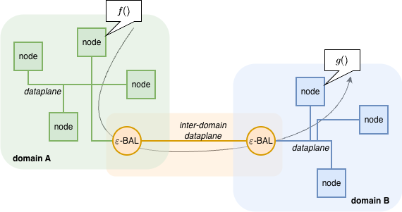
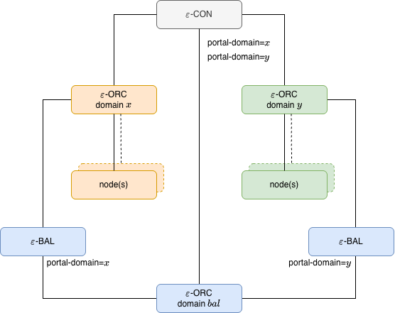
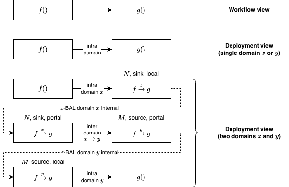
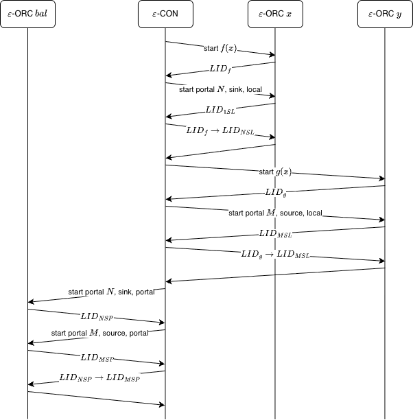

# Inter-domain workflows

EDGELESS supports workflows spanning across functions/resources in
different orchestration domains through ε-BAL, as in the figure below.

Let us assume that there are two domains, $x$ and $y$.
To enable inter-domain workflows, it is necessary to deploy the following
additional components:

- One ε-BAL in each domain (two in the example).
- One ε-ORC defining a _portal domain_, i.e., a domain that is only used to
  enable inter-domain workflows and is not required to host node

Each ε-BAL will expose itself as two EDGELESS nodes:

- In its local domain (domain $x$ or $y$ in the example).
- In the portal domain.

The ε-BALs offer no run-times and a single resource provider of class `portal`.

Let us consider a simple workflow, illustrated in the figure below, consisting
of two functions $f()$ and $g()$ in a chain via the channel `output` of the
first function.
If this workflow is deployed in a single domain, then the deployment view
(from the point of view of the ε-CON) precisely matches the workflow view
(from the point of view of the client).

However, if $f()$ and $g()$ are assigned to different domains, then the
deployment includes additional resources that are needed to implement
inter-domain function calling:

- One is deployed in the origin domain (in the example, it receives the
  events generated by $f()$).
- Two are deployed in the portal domain, using the portal dataplane to
  exchange events across domains.
- The last one is deployed in the target domain (in the example, it generates
  events directed to $g()$).

The corresponding sequence of commands sent by the ε-CON to the three ε-ORCs
for the example is illustrated below.

## Orchestration

Even if a portal domain is availale, the ε-CON always tries to assign all the
functions/resources of a workflow to the same domain.

Workflows are only deployed across multiple domains if a single domain cannot
host all the functions/resources, based on the capabilities advertised by the
ε-ORCs, or if the user intentionally migrates one function/resource to a
domain different from that of the other components in the workflow, e.g.,
via `edgeless_cli` (command `workflow migrate-component`).

It is possible to have, in a cluster, some domains that are not connected
to the portal.
For simplicity of operation, workflows are only deployed on those domains
if they can accept all the functions/resources.