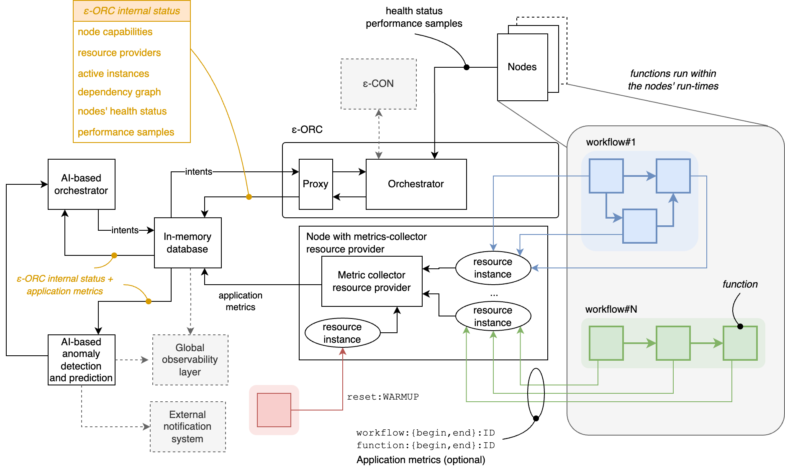
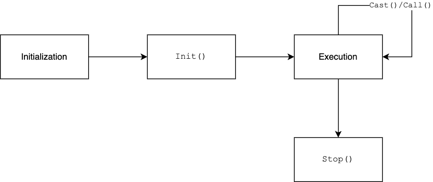

- [Local orchestration in EDGELESS](#local-orchestration-in-edgeless)
  - [Delegated orchestration through a proxy](#delegated-orchestration-through-a-proxy)
  - [Node's telemetry](#nodes-telemetry)
    - [Collection of application metrics](#collection-of-application-metrics)
  - [Step-by-step examples](#step-by-step-examples)
    - [Prerequisites](#prerequisites)
    - [Preparation steps](#preparation-steps)
    - [Example#1: telemetry and application metrics](#example1-telemetry-and-application-metrics)
    - [Example#2: delegated orchestration](#example2-delegated-orchestration)

# Local orchestration in EDGELESS

The ε-ORC implements a basic orchestration policy that:

1) honors the deployment requirements, and
2) ensures that one function instance is maintained in execution for all the
   accepted logical functions, if possible based on the deployment requirements.

If it is currently not possible to maintain in execution a function instance of
a given logical function, the ε-ORC will continue trying to create the
function or resource instance.

In all cases, the ε-ORC ensures that "patching", i.e., the interconnections
among function instances and resources for the exchange of events, is kept
up-to-date with the current components in execution.

Algorithms:

- If there are multiple resource providers that can host a resource,
  the ε-ORC selects one at random.
- If there are multiple nodes that can host a function instance, the ε-ORC
  uses one of the two basic strategies (which can be selected in the
  configuration file with `orchestration_strategy`):
  - `Random`: each node is assigned a weight equal to the product of the
  advertised number of CPUs, advertised number of cores per CPU, and
  advertised core frequency; then the node is selected using a weighted
  uniform random distribution;
  - `RoundRobin`: the ε-ORC keeps track of the last node used and
  assigns the next one (with wrap-around) among those eligible; note that
  this strategy does _not_ guarantee fairness if functions with different
  deployment requirements are requested.

The ε-ORC offers two optional mechanisms through a proxy:

1. Exposing the interval status and enabling delegated orchestration.
2. Collecting application metrics.

The following diagram illustrates these mechanisms, which are described separately below.



## Delegated orchestration through a proxy

This feature requires:

- an external in-memory database, e.g., Redis;
- the proxy feature enabled at the ε-ORC (see the
  [orchestrator's doc](orchestrator.md) for more details).

The proxy mirrors the internal data structures of the ε-ORC, so that an external
component, called **delegated orchestrator**  can make its decisions on which
function/resource instance should be executed on which node.

Such decisions are implemented by submitting _migration intents_ from the
delegated orchestrator to the ε-ORC through the proxy and they will be promptly
enforced, if possible.
If the migration is not feasible according to the deployment requirements,
the intent will be ignored by the ε-ORC.
For instance, if the latter receives a request to migrate a function instance
for which only nodes running in a TEE are allowed to a node that is not running
in a TEE, the ε-ORC will not enforce the intent.

The Redis proxy is enabled by means of the following section in `orchestrator.toml`: 

```ini
[proxy]
proxy_type = "Redis"
redis_url = "redis://127.0.0.1:6379"
```

To migrate the function with logical identifier `FID` to the node with
identifier `NODE` by operating manually through Redis, the delegated
orchestrator has two update two keys in the in-memory database:

1. Set the key `intent:migrate:FID` to `NODE`
2. Append the key `intent:migrate:FID` to the list `intents`

Multiple intents can be submitted at the same time: the ε-ORC will process them
in order from head to tail.

The command-line utility `proxy_cli` can be used as a convenient alternative:

```shell
proxy_cli intent migrate FID NODE
```

## Node's telemetry

EDGELESS nodes embed a telemetry system that collects some events related to
function lifecyle management, which is shown in the diagram below.



The telemetry sub-system also processes other types of events: function
instance exit (with termination status) and application-level log directives,
which can be added by the developers via `telemetry_log()` methods.

The processing of such telemetry events is configured in the `[telemetry]`
section of the node configuration file, for instance:

```ini
[telemetry]
metrics_url = "http://127.0.0.1:7003"
log_level = "info"
performance_samples = true
```

Where:

- `metrics_url`: URL of a web server that is exposed by the node with aggregated
  metrics using the [Prometheus](https://prometheus.io/) format. This is
  intended for throubleshooting purposes or to collect detailed data per node
  within a given orchestration domain by means of a process independent from
  the core EDGELESS ecosystem of tools; the web server can be disabled by
  specifying an empty string.
- `log_level`: defines the logging level of the events that are not captured
  by the Prometheus-like web server above, which are appended to the regular
  `edgeless_node` logs; logging can be disabled by specyfing an empty string.
- `performance_samples`: if true, then sends the function execution times
  to the ε-ORC as part of the response to keep-alive messages (see
  `performance:function_execution_time:UUID` in the table above).

### Collection of application metrics

This feature currently requires an external Redis in-memory database, which is
used to store the metrics, and it is enabled by adding one node to the
orchestration domain that exposes a `metrics-collector` resource provider via
the following section in `node.toml`: 

```ini
[resources.metrics_collector_provider]
collector_type = "Redis"
redis_url = "redis://localhost:6379"
provider = "metrics-collector-1"
```

Currently two types of metrics are supported: `workflow` and `function`.
For both types the developer is responsible for:

- associating samples with a unique numerical identifier;
- indicating the beginning and end of the process being measured.

This can be done through the following invocations:

| Event                                                        | Code                                                           |
| ------------------------------------------------------------ | -------------------------------------------------------------- |
| A function-related process uniquely identified by `id` began | `cast("metric", format!("function:begin:{}", id).as_bytes());` |
| A function-related process uniquely identified by `id` ended | `cast("metric", format!("function:end:{}", id).as_bytes());`   |
| A workflow-related process uniquely identified by `id` began | `cast("metric", format!("workflow:begin:{}", id).as_bytes());` |
| A workflow-related process uniquely identified by `id` ended | `cast("metric", format!("workflow:end:{}", id).as_bytes());`   |

In the workflow composition, the application developer is responsible for
mapping the output with name `"metric"` of the function to `metrics-collector`.
The configuration of the latter includes a field `wf_name` which allows
specifying an identifier of the workflow.

The content of the in-memory database is the following.

| Key                      | Value                                                                                                                                                                                                                                                                                                |
| ------------------------ | ---------------------------------------------------------------------------------------------------------------------------------------------------------------------------------------------------------------------------------------------------------------------------------------------------- |
| function:UUID:average    | A smoothed average of input samples received for the function with logical identifier UUID                                                                                                                                                                                                           |
| function:UUID:samples    | A list of values _sample_,_timestamp_, where _sample_ is the time (in ms) between function:begin and function:end for the function with physical identifier UUID and _timestamp_ is the time when function:end was received in fractional seconds since the Unix epoch with milliseconds granularity |
| workflow:WF_NAME:average | A smoothed average of input samples received for the workflow with identifier WF_NAME                                                                                                                                                                                                                |
| workflow:WF_NAME:samples | Same as function:UUID:samples but for the workflow with identifier WF_NAME                                                                                                                                                                                                                           |

Note that the metrics-collector automatically adds the _physical_ identifier of function instances for function-related metrics.
Multiple physical identifiers can be associated with a logical function during its lifetime.
The current mapping logical and physical identifier(s) can be found in the proxy information (instance:UUID entries).

## Step-by-step examples

### Prerequisites

- A local copy of the edgeless repository is built in debug mode according to
  the [building instructions](../BUILDING.md).
- A Redis is reachable at 127.0.0.1:6379, see
  [online instructions](https://redis.io/docs/latest/operate/oss_and_stack/install/install-redis/).
- The current working directory is the root of the repository.
- The command-line utility `redis-cli` is installed.
- [optional] `RUST_LOG=info ; export RUST_LOG`

### Preparation steps

In the following we will be running a minimal system with three nodes in a single
orchestration domain.
Create the default configuration files:

```bash
target/debug/edgeless_cli -t cli.toml
target/debug/edgeless_inabox -t -n 2 --metrics-collector
```

The latter will create the configuration files for the ε-CON, the ε-ORC, two
nodes with WebAssembly run-times, and one node with no function run-time but
a metrics-collector resource provider.

Modify the configuration of node0 and node1 so that performance samples are
also shared with the ε-ORC (this is disabled by default when creating the
templates):

```shell
sed -i -e "s/performance_samples = false/performance_samples = true/" node[01].toml
```

Compile the WASM bytecode of the `vector_mul` function, which performs the
multiplication of an internal random matrix by the vector received as input, and
of the `message_generator` function, which produces periodically a message with
given given payload and a counter:

```bash
target/debug/edgeless_cli function build functions/vector_mul/function.json
target/debug/edgeless_cli function build functions/message_generator/function.json
```

### Example#1: telemetry and application metrics

Run the system:

```bash
target/debug/edgeless_inabox
```

Start a workflow consisting of three `vector_mul` functions in a chain:

```bash
target/debug/edgeless_cli workflow start examples/vector_mul/workflow-chain.json
```

The full status of the in-memory database, including a mirror of the ε-ORC
internal data structures of the application metrics sampled, can be dumped with
a script provided:

```bash
scripts/redis_dump.sh
```

Or, more conveniently, it is possible to selective query the Redis through the
`proxy_cli` command-line utility provided.
For example, to show the nodes' heath status:

```shell
target/debug/proxy_cli show node health
```

Example of output:

```
4595df5d-21c9-43a5-8b69-006b85eced96 -> memory free 307984 kb, used 24581664 kb, available 4496208 kb, process cpu usage 105%, memory 878432 kb, vmemory 437445216 kb, load avg 1 minute 361% 5 minutes 329% 15 minutes 290%, network tot rx 6656099328 bytes (43499471 pkts) 0 errs, tot tx 25220091 bytes (4136598528 pkts) 0 errs, disk available 994662584320 bytes, tot disk reads 193711325184 writes 119523094528, gpu_load_perc -1%, gpu_temp_cels -1.00°
c422eb3d-98e4-4a6f-855e-45b879ab3e40 -> memory free 21696 kb, used 24831328 kb, available 4073872 kb, process cpu usage 0%, memory 878384 kb, vmemory 437443152 kb, load avg 1 minute 363% 5 minutes 328% 15 minutes 289%, network tot rx 6652385280 bytes (43495784 pkts) 0 errs, tot tx 25217790 bytes (4133952512 pkts) 0 errs, disk available 994662584320 bytes, tot disk reads 193711267840 writes 119525015552, gpu_load_perc -1%, gpu_temp_cels -1.00°
faaf87ba-9b46-4ff6-ac42-3fca12523128 -> memory free 307984 kb, used 24581664 kb, available 4496208 kb, process cpu usage 105%, memory 878480 kb, vmemory 437445216 kb, load avg 1 minute 361% 5 minutes 329% 15 minutes 290%, network tot rx 6656099328 bytes (43499471 pkts) 0 errs, tot tx 25220091 bytes (4136598528 pkts) 0 errs, disk available 994662584320 bytes, tot disk reads 193711325184 writes 119523094528, gpu_load_perc -1%, gpu_temp_cels -1.00°
```

To show the current mapping of functions/resources to nodes:

```shell
target/debug/proxy_cli show node instances
```

Example of output:

```
4595df5d-21c9-43a5-8b69-006b85eced96
[F] 7fdfea80-2a12-4b0b-9658-08525452bc22
[F] 1f427c5f-a491-4347-854d-ea846b80bf3d
c422eb3d-98e4-4a6f-855e-45b879ab3e40
[R] 4dd4c855-5702-477d-b97d-76475b6f0767
faaf87ba-9b46-4ff6-ac42-3fca12523128
[F] b615f0b3-4d0e-4df8-87b4-3fea0200682b
```

As you can see, the metrics-collector node is only assigned one instance of
type `R`, i.e., resource, while the three functions (`F`) are split between the
two nodes with a WebAssembly run-time.

With regard to performance samples (collected by the nodes' telemetry), they can
dumped to files with:

```shell
target/debug/proxy_cli dump performance
```

The command will create one file for each function instance containing the
timeseries of the execution times, for example (first 5 entries only):

```
0.243379291,1725557090.92
0.245919917,1725557090.92
0.238143375,1725557090.92
0.237986959,1725557090.92
0.241142625,1725557092.9
```

Where the first column contains the execution time, in fractional seconds,
and the second one the timestamp of when the performance sample was received
by the ε-ORC in response to a keep-alive.

Finally, since the `vector_mul` function supports application-related metrics,
these are also saved in Redis.

For instance, the average latency of the workflow can be queried with the
`redis-cli` command-line utility:

```bash
redis-cli get workflow:vector_mul_wf_chain:average
```

Where `vector_mul_wf_chain` is the name assigned to the workflow in
`workflow-chain.json`.

Example of output:

```
"930.679962190782"
```

Instead, the last 5 samples, with timestamps, are given by:

```bash
redis-cli lrange workflow:vector_mul_wf_chain:samples 0 4
```

Example of output:

```
1) "849,1718287852.177"
2) "958,1718287851.316"
3) "911,1718287850.347"
4) "896,1718287849.425"
5) "843,1718287848.516"
```

### Example#2: delegated orchestration

Run the system:

```bash
target/debug/edgeless_inabox
```

Create a workflow consisting of a `message_generator` feeding a `file-log`
resource, which saves to a local file the content of the messages received,
optionally adding a timestamp, with the following command:

```bash
ID=$(target/debug/edgeless_cli workflow start examples/file_log/workflow.json)
```

In another shell you can see the content of `my-local-file.log` growing each
second:

```bash
tail -f my-local-file.log
```

Example of output:

```log
2024-12-12T11:56:30.023820+00:00 from node_id faaf87ba-9b46-4ff6-ac42-3fca12523128 function_id 597df9c4-db7f-4c5e-a716-bd8daeb7f480 [#0]: hello world
2024-12-12T11:56:31.061053+00:00 from node_id faaf87ba-9b46-4ff6-ac42-3fca12523128 function_id 597df9c4-db7f-4c5e-a716-bd8daeb7f480 [#1]: hello world
2024-12-12T11:56:32.285220+00:00 from node_id faaf87ba-9b46-4ff6-ac42-3fca12523128 function_id 597df9c4-db7f-4c5e-a716-bd8daeb7f480 [#2]: hello world
2024-12-12T11:56:33.287956+00:00 from node_id faaf87ba-9b46-4ff6-ac42-3fca12523128 function_id 597df9c4-db7f-4c5e-a716-bd8daeb7f480 [#3]: hello world
2024-12-12T11:56:34.460250+00:00 from node_id faaf87ba-9b46-4ff6-ac42-3fca12523128 function_id 597df9c4-db7f-4c5e-a716-bd8daeb7f480 [#4]: hello world
```

With the following command we can see the assignment of functions/resources
to nodes:

```shell
target/debug/proxy_cli show node instances
```

Example output:

```
4595df5d-21c9-43a5-8b69-006b85eced96
[F] ed0b963e-d6ff-4d62-84dc-7de9a2175913
[R] 16668152-2a27-4632-a482-336096c1be44
```

From the output we can see that the function `ed0b963e...` has been assigned
to node `4595df5d...`, like the resource.
Let us migrate the function to the other node:

```shell
target/debug/proxy_cli intent migrate \
  ed0b963e-d6ff-4d62-84dc-7de9a2175913 \
  faaf87ba-9b46-4ff6-ac42-3fca12523128
```

Running again:

```shell
target/debug/proxy_cli show node instances
```

We now see:

```
4595df5d-21c9-43a5-8b69-006b85eced96
[R] 16668152-2a27-4632-a482-336096c1be44
faaf87ba-9b46-4ff6-ac42-3fca12523128
[F] ed0b963e-d6ff-4d62-84dc-7de9a2175913
```

Note that the counter in `my-local-file.log` counter restarted from 0 upon
migrating, because it is kept in a function-local state
that is lost when the original function instance is terminated.