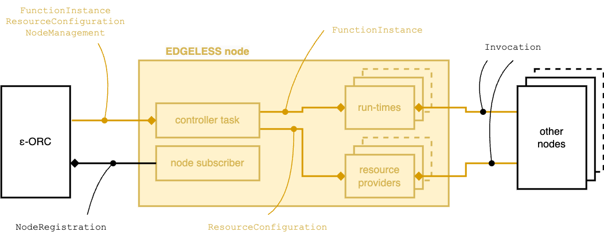

# EDGELESS node

|                        |                   |
| ---------------------- | ----------------- |
| Executable name        | `edgeless_node_d` |
| Default conf file name | `node.toml`       |

The node is the component that hosts the function and resource instances,
thereby providing computing facilities (functions) and connecting EDGELESS
with external entities in the real world (resources).

Depending on the configuration, it can host multiple run-time environments
(such as WebAssembly and Docker containers) and resource providers, see
[basic concepts](basic_concepts.md) for more info on what is currently
supported.

All the nodes in an orchestration domain are interconnected to one another
via a full mesh of gRPC services creating a _data plane_ for the dispatch
of events in a synchronous or asynchronous manner, respectively via the
call and cast methods.

The node subscribes to its ε-ORC via the `NodeRegistration` API,
periodically refreshing the subscription (the period is configurable in the
configuration file).
When a node first enters a cluster, its functions and resources are reset.

The node has the following interfaces, also illustrated in the diagram below:

| Interface             | Configuration file URL |
| --------------------- | ---------------------- |
| FunctionInstance      | `agent_url`            |
| ResourceConfiguration | `agent_url`            |
| NodeManagement        | `agent_url`            |
| Invocation            | `invocation_url`       |

