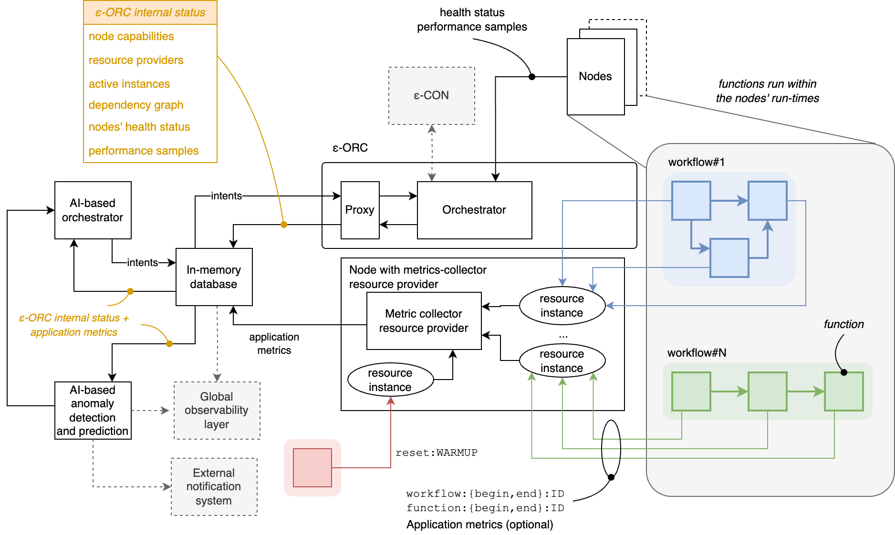

# EDGELESS orchestration

Orchestration in EDGELESS happens at two levels:

- _higher level orchestration_ is done by the ε-CON at cluster level (remember
  that a cluster may include multiple non-overlapping orchestration domains)
  and it maps (logical) function to orchestration domains;
- _lower level orchestration_ is done by the ε-ORC within its orchestration
  domain, and it maps every (logical) function to one or multiple workers
  running on the orchestration domain nodes.

## Higher level orchestration (ε-CON)

Work in progress

## Lower level orchestration (ε-ORC)

The ε-ORC implements a basic orchestration policy that:

1) honors the deployment requirements, and
2) ensures that one function instance is maintained in execution for all the
   accepted logical functions, if possible based on the deployment requirements.

If it is currently not possible to maintain in execution a function instance of
a given logical function, the ε-ORC will continue trying to create the
function instance every `keep_alive_interval_secs` (in the configuration file).

The same period is also used to poll all the nodes in an orchestration domain:
if a node does not respond, then it is immediately removed from the list of
active nodes and its functions/resources are relocated to other nodes, if
possible.

In all cases, the ε-ORC ensures that "patching", i.e., the interconnections
among function instances and resources for the exchange of events, is kept
up-to-date with the current components in execution.

Algorithms:

- If there are multiple resource providers that can host a resource,
  the ε-ORC selects one at random.
- If there are multiple nodes that can host a function instance, the ε-ORC
  uses one of the two basic strategies (which can be selected in the
  configuration file with `orchestration_strategy`):
  - `Random`: each node is assigned a weight equal to the product of the
  advertised number of CPUs, advertised number of cores per CPU, and
  advertised core frequency; then the node is selected using a weighted
  uniform random distribution;
  - `RoundRobin`: the ε-ORC keeps track of the last node used and
  assigns the next one (with wrap-around) among those eligible; note that
  this strategy does _not_ guarantee fairness if functions with different
  deployment requirements are requested.

The ε-ORC offers two optional mechanisms:

1. Enabling delegated orchestration through a proxy.
2. Collecting application metrics.

The following diagram illustrates these mechanisms, which are described separately below.



### Delegated orchestration through a proxy

This feature currently requires an external Redis in-memory database, which is used to:

- mirror the internal data structures of the ε-ORC: these are updated periodically by ε-ORC and read by the delegated orchestrator to take its decisions, and
- receive orchestration intents: once the delegated orchestrator has taken a decision it informs the ε-ORC by updating the in-memory database with its intents, which will be promptly enforced, if possible.

_The in-memory database is flushed by the ε-ORC when it starts._

The Redis proxy is enabled by means of the following section in `orchestrator.toml`: 

```ini
[proxy]
proxy_type = "Redis"
redis_url = "redis://127.0.0.1:6379"
```

The ε-ORC internal status is serialized to Redis by means of the following entries:

| Key                     | Value                                                                                                                                                                         | `struct`                               |
| ----------------------- | ----------------------------------------------------------------------------------------------------------------------------------------------------------------------------- | -------------------------------------- |
| nodes:capabilities:UUID | JSON object representing the capabilities of the node with given UUID                                                                                                         | `NodeCapabilities`                     |
| node:health:UUID        | JSON object representing the health status of the node with given UUID                                                                                                        | `HealthStatus`                         |
| provider:ID             | JSON object representing the configuration of the resource provider with given ID                                                                                             | `ResourceProvider`                     |
| instance:UUID           | JSON object including the annotations of the function with given logical UUID and the currently active instances (each with node identifier and physical function identifier) | `ActiveInstance`                       |
| dependency:UUID         | JSON object representing the dependencies of the function with given logical UUID through a map of output channel names to logical function identifiers                       | `HashMap<Uuid, HashMap<String, Uuid>>` |
|                         |

Currently, we only support one intent type, which allows the delegated orchestrator to migrate one function instance from its current node to another.
Note that this operation must be feasible according to the deployment requirements, otherwise it will be ignored by the ε-ORC.
For instance, if the latter receives a request to migrate a function instance for which only nodes running in a TEE are allowed to a node that is not running in a TEE, the ε-ORC will not enforce the intent.

To migrate the function with logical identifier `FID` to the node with identifier `NODE`, the delegated orchestrator has two update two keys in the in-memory database:

1. Set the key `intent:migrate:FID` to `NODE`
2. Append the key `intent:migrate:FID` to the list `intents`

Multiple intents can be submitted at the same time: the ε-ORC will process them in order from head to tail.

### Collection of application metrics

This feature currently requires an external Redis in-memory database, which is used to store the metrics, and it is enabled by means of the following section in `orchestrator.toml`: 

```ini
[collector]
collector_type = "Redis"
redis_url = "redis://127.0.0.1:6379"
```

If enabled the ε-ORC also hosts a node, with no associated run-times, that exposes a resource provider called `metrics-collector`, which is in charge of receiving and processing application metrics.

Currently two types of metrics are supported: `workflow` and `function`.
For both types the developer is responsible for:

- associating samples with a unique numerical identifier;
- indicating the beginning and end of the process being measured.

This can be done through the following invocations:

| Event                                                        | Code                                                           |
| ------------------------------------------------------------ | -------------------------------------------------------------- |
| A function-related process uniquely identified by `id` began | `cast("metric", format!("function:begin:{}", id).as_bytes());` |
| A function-related process uniquely identified by `id` ended | `cast("metric", format!("function:end:{}", id).as_bytes());`   |
| A workflow-related process uniquely identified by `id` began | `cast("metric", format!("workflow:begin:{}", id).as_bytes());` |
| A workflow-related process uniquely identified by `id` ended | `cast("metric", format!("workflow:end:{}", id).as_bytes());`   |

In the workflow composition, the application developer is responsible for mapping the output with name `"metric"` of the function to `metrics-collector`.
The configuration of the latter includes a field `wf_name` which allows specifying an identifier of the workflow.

The content of the in-memory database is the following.

| Key                      | Value                                                                                                                                                                                                                                                                                               |
| ------------------------ | --------------------------------------------------------------------------------------------------------------------------------------------------------------------------------------------------------------------------------------------------------------------------------------------------- |
| function:UUID:average    | A smoothed average of input samples received for the function with logical identifier UUID                                                                                                                                                                                                          |
| function:UUID:samples    | A list of values _sample_,_timestamp_, where _sample_ is the time (in ms) between function:begin and function:end for the function with logical identifier UUID and _timestamp_ is the time when function:end was received in fractional seconds since the Unix epoch with milliseconds granularity |
| workflow:WF_NAME:average | A smoothed average of input samples received for the workflow with identifier WF_NAME                                                                                                                                                                                                               |
| workflow:WF_NAME:samples | Same as function:UUID:samples but for the workflow with identifier WF_NAME                                                                                                                                                                                                                          |

### Step-by-step example

Prerequisites:

- A local copy of the edgeless repository is built in debug mode according to the [building instructions](../BUILDING.md).
- A Redis is reachable at 127.0.0.1:6379, see [online instructions](https://redis.io/docs/latest/operate/oss_and_stack/install/install-redis/).
- The current working directory is the root of the repository.
- The command-line utility `redis-cli` is installed.
- [optional] `RUST_LOG=info ; export RUST_LOG`

In the following we will be running a minimal system with two nodes in a single orchestration domain.
The instructions follow.

Create the default configuration files:

```bash
target/debug/edgeless_inabox -t
target/debug/edgeless_cli -t cli.toml
```

Modify the `orchestrator.toml` file so that the `[proxy]` and `[collection]` sections are:

```ini
[proxy]
proxy_type = "Redis"
redis_url = "redis://127.0.0.1:6379"

[collector]
collector_type = "Redis"
redis_url = "redis://127.0.0.1:6379"
```

Create the configuration file `node-2.toml` for another node, with a Rust run-time, no resources associated, and default node's capabilities:

```ini
[general]
node_id = "fda6ce79-46df-4f96-a0d2-456f720f606d"
agent_url = "http://127.0.0.1:7221"
agent_url_announced = ""
invocation_url = "http://127.0.0.1:7202"
invocation_url_announced = ""
metrics_url = "http://127.0.0.1:7203"
orchestrator_url = "http://127.0.0.1:7011"

[wasm_runtime]
enabled = true
```

In one shell run:

```bash
target/debug/edgeless_inabox
```

In another shell run:

```bash
target/debug/edgeless_node_d -c node-2.toml
```

Compile the WASM bytecode of the `vector_mul` function, which performs the multiplication of an internal random matrix by the vector received as input:

```bash
target/debug/edgeless_cli function build \
  edgeless_benchmark/functions/vector_mul/function.json
```

Start a workflow consisting of three `vector_mul` functions in a chain:

```bash
target/debug/edgeless_cli workflow start edgeless_benchmark/functions/vector_mul/workflow-chain.json
```

The full status of the in-memory database, including a mirror of the ε-ORC internal data structures of the application metrics sampled, can be dumped with a script provided:

```bash
scripts/redis_dump.sh
```

For instance, the average latency of the workflow can be queried with the `redis-cli` command-line utility:

```bash
redis-cli get workflow:wf_chain:average
```

Where `wf_chain` is the name assigned to the workflow in `workflow-chain.json`.

Example of output:

```
"930.679962190782"
```

Instead, the last 5 samples, with timestamps, are given by:

```bash
redis-cli lrange workflow:wf_chain:samples 0 4
```

Example of output:

```
1) "849,1718287852.177"
2) "958,1718287851.316"
3) "911,1718287850.347"
4) "896,1718287849.425"
5) "843,1718287848.516"
```

This completes the example on the collection of application metrics.
We now move to the delegated orchestration.

Compile the WASM bytecode of the `message_generator` function, which produces periodically a message with given given payload and a counter:

```bash
target/debug/edgeless_cli function build \
  examples/file_log/message_generator/function.json
```

Create a workflow consisting of a `message_generator` feeding a `file-log` resource, which saves to a local file the content of the messages received, optionally adding a timestamp, with the following command:

```bash
target/debug/edgeless_cli workflow start examples/file_log/workflow.json
```

In another shell you can see the content of `my-local-file.log` growing each second:

```bash
tail -f my-local-file.log
```

Example of output:

```
...
2024-06-13T10:31:45.274503178+00:00 from node_id fda6ce79-46df-4f96-a0d2-456f720f606d function_id d7d613bd-ef6c-4ab8-8df9-cd9745fbe592 [#40]: hello world
2024-06-13T10:31:45.380866357+00:00 from node_id fda6ce79-46df-4f96-a0d2-456f720f606d function_id d7d613bd-ef6c-4ab8-8df9-cd9745fbe592 [#41]: hello world
2024-06-13T10:31:45.487154114+00:00 from node_id fda6ce79-46df-4f96-a0d2-456f720f606d function_id d7d613bd-ef6c-4ab8-8df9-cd9745fbe592 [#42]: hello world
```

This also tells us that the function instance of `message_generator` has been assigned to the node `fda6ce79-46df-4f96-a0d2-456f720f606d`.
If we want to migrate the function instance to the other node, which has the same UUID except for the last digit (`c` instead of `d`) then we need to know what is the logical UUID of the function.
This can be retrieved, for instance, from the in-memory database:

```bash
scripts/redis_dump.sh | grep 'hello world' -B 1
```

Example output:

```
instance:e7f15354-8917-442f-9a98-3cd80cccb94e
{ "Function": [ { "annotations": { "init-payload": "message=hello world,period=1000" } }, [ "InstanceId(node_id: fda6ce79-46df-4f96-a0d2-456f720f606d, function_id: 10c1d3e3-2eca-45c8-9ef7-f2e0dfaa944c)" ] ] }
```

At this point we can migrate the function to the node whose identifier ends with `c` with the following utility:

```bash
FID=e7f15354-8917-442f-9a98-3cd80cccb94e \
NODE=fda6ce79-46df-4f96-a0d2-456f720f606c \
  scripts/intent_migrate.sh
```

This will add an intent to Redis, which will promptly instruct the ε-ORC to perform the migration.
This is visible from the content of the `my-local-file.log` which now contains

```
...
2024-06-13T14:25:23.857453456+00:00 from node_id fda6ce79-46df-4f96-a0d2-456f720f606d function_id 10c1d3e3-2eca-45c8-9ef7-f2e0dfaa944c [#565]: hello world
2024-06-13T14:25:24.999761806+00:00 from node_id fda6ce79-46df-4f96-a0d2-456f720f606c function_id f5182ce5-ca3f-40c0-b28d-02407e1ddda0 [#0]: hello world
2024-06-13T14:25:26.136408748+00:00 from node_id fda6ce79-46df-4f96-a0d2-456f720f606c function_id f5182ce5-ca3f-40c0-b28d-02407e1ddda0 [#1]: hello world
2024-06-13T14:25:27.541362089+00:00 from node_id fda6ce79-46df-4f96-a0d2-456f720f606c function_id f5182ce5-ca3f-40c0-b28d-02407e1ddda0 [#2]: hello world
```

Note that:

- the identifier of the node now ends with `c`;
- the counter restarted from 0, because it is kept in a function-local state that is lost when the function instance is migrated.