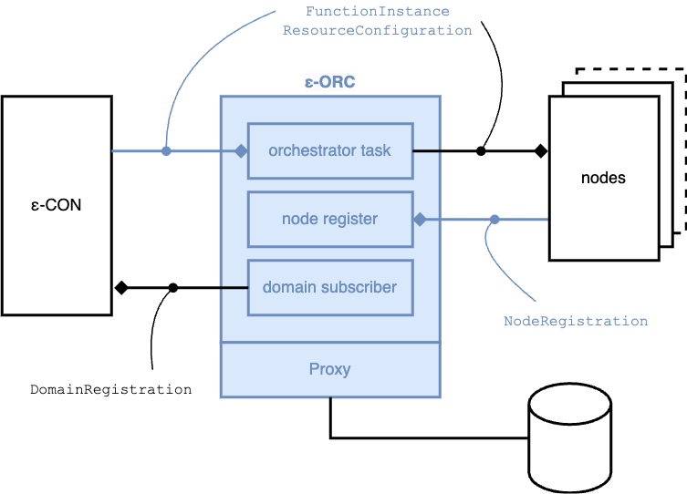
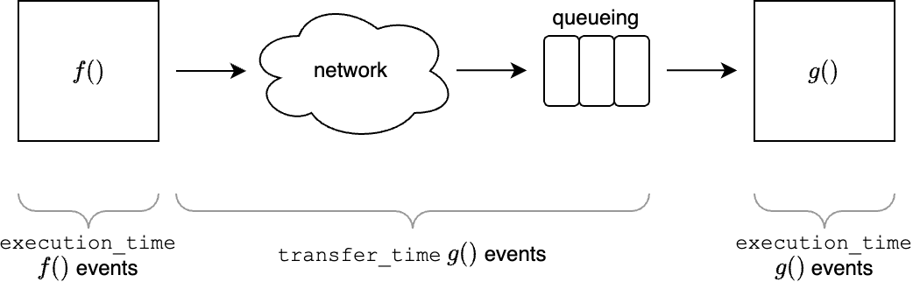

# EDGELESS orchestrator (ε-ORC)

|                        |                     |
| ---------------------- | ------------------- |
| Executable name        | `edgeless_orc_d`    |
| Default conf file name | `orchestrator.toml` |

The ε-ORC is the component that manages an EDGELESS orchestration domain.
It has the following main responsibilities:

1. **Domain formation**: it offers a `NodeRegistration` API through which
   nodes may register and notify their (static) capabilities and (dynamic)
   system information metrics. The nodes refresh periodically their
   registration with the ε-ORC, also indicating a deadline by which a lack of
   refresh should be considered as a failure.
2. **Domain orchestration**: the ε-CON assigns to the ε-ORC function and
   resource instances, which it is then responsible for handling at best
   within the nodes in its domain.
3. **Proxy maintenance**: the ε-ORC may optionally synchronize its internal
   data structures and performance metrics with an external database via
   a _Proxy_. The database can then be queried by third-party services for
   monitoring purposes or to implement the delegated orchestrator concept.

The ε-ORC subscribes to its ε-CON via the `DomainRegistration` API,
periodically refreshing the subscription (the period is configurable in the
configuration file).
When an ε-ORC first enters a cluster, its functions and resources are reset.

The ε-ORC has the following interfaces, also illustrated in the diagram below:

| Interface             | Configuration file URL |
| --------------------- | ---------------------- |
| FunctionInstance      | `orchestrator_url`     |
| ResourceConfiguration | `orchestrator_url`     |
| NodeRegistration      | `node_register_url`    |



## Proxy

When used, the ε-ORC mirrors its internal data structures on the proxy.

Currently, we only support Redis, which is enabled by means of the following
section in `orchestrator.toml`: 

```ini
[proxy]
proxy_type = "Redis"
redis_url = "redis://127.0.0.1:6379"
```

_The Redis database is flushed automatically by the ε-ORC when it starts._

We provide a command-line interface, called `proxy_cli`, which can be used
as a convenient alternative to reading directly from the Redis database.

### Schema

#### Scalars

| Key                          | Value                                                                                                                                                                                                             | Data type                              | When updated                                             |
| ---------------------------- | ----------------------------------------------------------------------------------------------------------------------------------------------------------------------------------------------------------------- | -------------------------------------- | -------------------------------------------------------- |
| domain_info:domain_id        | Identifier of the domain managed by this ε-ORC                                                                                                                                                                    | `String`                               | At service start                                         |
| nodes:capabilities:`node_id` | JSON object representing the capabilities of the node with given node identifier                                                                                                                                  | `NodeCapabilities`                     | When a node joins the domain or updates its capabilities |
| provider:`provider_id`       | JSON object representing the configuration of the resource provider with given identifier                                                                                                                         | `ResourceProvider`                     | When the resource provider is announced by the node      |
| instance:`lid`               | JSON object representing an active instance with logical identifier `lid`, which can be either a function or a resource, and its currently instances (each with node identifier and physical function identifier) | `ActiveInstance`                       | When the function or resource is created or modified     |
| dependency:`lid`             | JSON object representing the dependencies of the function with given logical identifier `lid` through a map of output channel names to logical function identifiers                                               | `HashMap<Uuid, HashMap<String, Uuid>>` | When the dependency is announced or modified             |

The value of the following keys are updated with a timestamp when the
corresponding data structure is updated:

- `nodes:capabilities:last_update`
- `provider:last_update`
- `instance:last_update`
- `dependency:last_update`

#### Sorted sets

The values below are stored as sorted sets, with a score equal to
the timestamp of when they have been retrieved.
They are all updated when the node refreshes its registration with the ε-ORC.

| Key                                       | Element value                                                                                                                                                                         | Data type          |
| ----------------------------------------- | ------------------------------------------------------------------------------------------------------------------------------------------------------------------------------------- | ------------------ |
| node:health:`node_id`                     | JSON object representing the health status of the node identifier specified in the key                                                                                                | `NodeHealthStatus` |
| performance:function_execution_time:`pid` | Execution time of the function/resource with the given `pid`, in fractional seconds, each associated with the timestamp of when the function/resource execution completed at the node | `timestamp:value`  |
| performance:function_transfer_time:`pid`  | Transfer time of the function/resource with the given `pid`, in fractional seconds, each associated with the timestamp of when the function/resource execution began at the node      | `timestamp:value`  |

Old values in the sorted sets above are periodically purged from the proxy,
with the period configured in the ε-ORC's configuration file as
`proxy.proxy_gc_period_seconds`.


##### Function execution vs. transfer time

For every event handled by a function or resource, the node tracks the time it
takes to handle it (_execution time_) and the time needed for the event to
reach the handler, including both the network latency and the time spent by the
event in queue if there are other events currently being handled by the same
instance (_transfer time_).
This is illustrated in the following diagram, which shows function _f()_
invoking its successor function _g()_.



_Note that the transfer time is only accurate if the two nodes involved in the
invocation are synchronized in time_.

#### Identifiers and other types

The following identifiers are represented in
[UUID](https://en.wikipedia.org/wiki/Universally_unique_identifier) format:

- node's identifier (`node_id`)
- logical function/resource instance identifier (`lid`)
- physical function/resource instance identifier (`pid`)

The following identifiers are represented as free-text strings:

- domain identifier
- provider identifier

All the timestamps are represented as `secs.nsecs` where:

- `secs`: number of non-leap seconds since UNIX timestamp
- `nsecs`: number of nanoseconds since the last second boundary