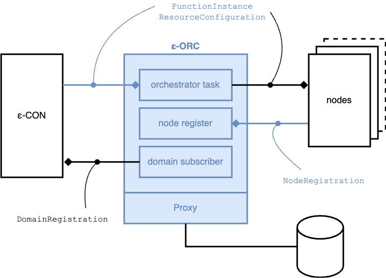
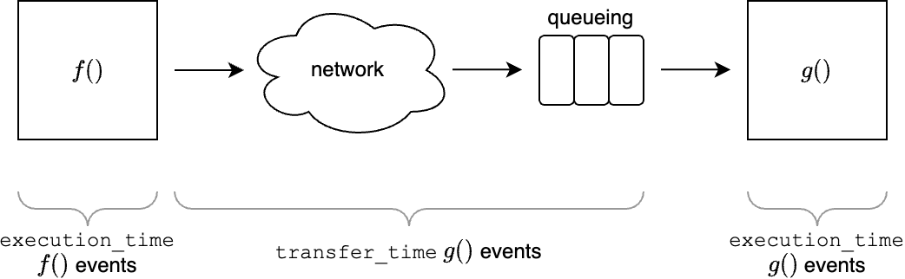

# EDGELESS orchestrator (ε-ORC)

|                        |                     |
| ---------------------- | ------------------- |
| Executable name        | `edgeless_orc_d`    |
| Default conf file name | `orchestrator.toml` |

The ε-ORC is the component that manages an EDGELESS orchestration domain.
It has the following main responsibilities:

1. **Domain formation**: it offers a `NodeRegistration` API through which
   nodes may register and notify their (static) capabilities and (dynamic)
   system information metrics. The nodes refresh periodically their
   registration with the ε-ORC, also indicating a deadline by which a lack of
   refresh should be considered as a failure.
2. **Domain orchestration**: the ε-CON assigns to the ε-ORC function and
   resource instances, which it is then responsible for handling at best
   within the nodes in its domain.
3. **Proxy maintenance**: the ε-ORC may optionally synchronize its internal
   data structures and performance metrics with an external database via
   a _Proxy_. The database can then be queried by third-party services for
   monitoring purposes or to implement the delegated orchestrator concept.

The ε-ORC subscribes to its ε-CON via the `DomainRegistration` API,
periodically refreshing the subscription (the period is configurable in the
configuration file).
When an ε-ORC first enters a cluster, its functions and resources are reset.

The ε-ORC has the following interfaces, also illustrated in the diagram below:

| Interface             | Configuration file URL |
| --------------------- | ---------------------- |
| FunctionInstance      | `orchestrator_url`     |
| ResourceConfiguration | `orchestrator_url`     |
| NodeRegistration      | `node_register_url`    |



## Replication & Failover

The ε-ORC monitors node health through periodic registration refreshes.
When a node fails to refresh within its declared deadline, the ε-ORC considers
it disconnected and handles all functions that were running on it according to
their `replication_factor` setting.

### `replication_factor` semantics

Each function in a workflow may declare a `replication_factor` that controls
how the ε-ORC reacts when the function's node fails:

| `replication_factor` | Behaviour on node failure |
| -------------------- | ------------------------- |
| _not set_ (`null`)   | **Fail-fast.** The entire workflow is stopped immediately. This is the default. |
| `0`                  | **Expendable.** The function is silently removed from the workflow; remaining functions continue operating. Useful for optional/best-effort functions like metrics collectors. |
| `1`                  | **Reschedule.** The function is restarted on a surviving node. The workflow continues but the function experiences downtime during rescheduling. |
| `≥ 2`               | **Hot-standby (KPI-13).** `N` replicas are started on distinct nodes: one _active_ instance processes events, while `N − 1` _standby_ instances are pre-deployed and receive dataplane patches so they can be promoted instantly. |

### Hot-standby failover (KPI-13)

When `replication_factor ≥ 2`, the ε-ORC implements a two-phase failure
detection loop, prioritising critical (hot-standby) functions:

1. **Critical path** — The ε-ORC iterates over all functions with
   `replication_factor ≥ 2` (_critical LIDs_). For each one:
   - Dead instances (on disconnected nodes) are removed.
   - If the _active_ instance is dead and a standby exists, the standby is
     promoted to active and all dataplane patches are recomputed and applied.
   - A new standby replica is queued for creation to restore the desired
     replication level.
   - If no standby is available for promotion, the workflow is stopped.
2. **Non-critical path** — All remaining functions on disconnected nodes are
   handled according to their `replication_factor` (fail-fast / expendable /
   reschedule, as described above).
3. **Replica replenishment** — New standby replicas queued during the critical
   path are spawned on surviving nodes.

The critical path is instrumented with a `kpi_13_failover` tracing span so
failover latency can be measured end-to-end.

### Node placement

For `replication_factor ≥ 2`, the ε-ORC ensures that each replica is placed on
a **distinct node**. If there are not enough feasible nodes to satisfy the
requested replication factor at deployment time, the workflow creation is
rejected. Node selection follows the configured orchestration strategy
(round-robin or random), excluding nodes that already host a replica of the
same function.


- [EDGELESS orchestrator (ε-ORC)](#edgeless-orchestrator-ε-orc)
  - [Replication & Failover](#replication--failover)
    - [`replication_factor` semantics](#replication_factor-semantics)
    - [Hot-standby failover (KPI-13)](#hot-standby-failover-kpi-13)
    - [Node placement](#node-placement)
  - [Proxy](#proxy)
    - [Intents](#intents)
    - [Redis schema](#redis-schema)
      - [STRING keys](#string-keys)
      - [SORTED\_SET keys](#sorted_set-keys)
        - [Function execution vs. transfer time](#function-execution-vs-transfer-time)
        - [Custom log entries](#custom-log-entries)
      - [Identifiers and other types](#identifiers-and-other-types)
  - [Dataset creation](#dataset-creation)

## Proxy

When used, the ε-ORC periodically pushes runtime metrics and mirrors its internal data structures to the proxy.

Currently, we only support Redis, which is enabled by means of the following
section in `orchestrator.toml`: 

```ini
[proxy]
proxy_type = "Redis"
redis_url = "redis://127.0.0.1:6379"
```

_Valkey is supported as a Redis alternative, as it shares the same functionality and default data structures. However, the `proxy_type` should still be `"Redis"`_

To interact with the key-value datastore server (redis), there are three aproaches:
- Use the `redis-cli` tool directly.
- Use the utility script at `edgeless/scripts/redis_dump.sh`.
- Use `proxy_cli`, a CLI tool developed for this project as a convenient alternative to reading directly from the Redis database.

### Intents

In addition to viewing the current status of the local orchestration domain (nodes' health and capabilities, performance values, etc -- see next section), `proxy_cli` can be used to communicate _intents_ to the ε-ORC:

- migrations: command to relocate a function/resource instance from its current node to another one specified;
- cordoning: command to cordon (or uncordon) a node; cordoned nodes are never assigned new functions or resources.

For example, to prevent new functions/resources to be deployed on `$NODE1`, e.g., because you are planning to shut it down for a scheduled maintenance:

```
proxy_cli intent cordon $NODE1
```

When done, normal operation can be resumed with:

```
proxy_cli intent uncordon $NODE1
```

Finally, to migrate the instance `$ID1` to that node:

```
proxy_cli intent migrate $ID1 $NODE1
```

### Redis schema

Key-value datastores such as Redis don't follow a filesystem structure, and all keys are differenciated only by prefixes known as *namespaces* (e.g. `domain_info:domain_id`).
Current keys are only of one of two types: STRING or SORTED_SET

#### STRING keys

| Namespace            | Key                                      | Value                                                                                                                                             | Data Structure                                   | Updated When                                                        | Example                                                       |
| -------------------- | ---------------------------------------- | ------------------------------------------------------------------------------------------------------------------------------------------------- | ------------------------------------------------ | ------------------------------------------------------------------- | ------------------------------------------------------------- |
| `domain_info`        | `domain_id`                              | Value **`domain_id`** of the orchestration domain's ε-ORC                                                                                         | String                                           | ε-ORC starts                                                        | `domain-7000`                                                 |
| `node:capabilities:` | `<node_UUID>`                            | JSON object representing the *capabilities* of a node registered in the orchestration domain                                                      | `NodeCapabilities` JSON object                   | The node joins the orchestration domain or updates its capabilities | See [data structures reference](data_structures_reference.md) |
| `node:capabilities:` | `last_update`                            | Last update of the `node:capabilities` namespace                                                                                                  | Unix epoch timestamp with miliseconds            | Any node joins the orchestration domain or updates its capabilities | `1750160496.85848`                                            |
| `provider:`          | `<node_hostname>-<resource_provider_id>` | JSON object with the *configuration* of a resource provider from a registered node                                                                | `ResourceProvider` JSON object                   | The resource provider is announced by its node                      | See [data structures reference](data_structures_reference.md) |
| `provider:`          | `last_update`                            | Last update of the `provider:` namespace                                                                                                          | Unix epoch timestamp with miliseconds            | Any resource provider is announced by its node                      | `1750159583.7702973`                                          |
| `instance:`          | `<logical_UUID>`                         | JSON object with information about a logical function/resource instance and its physical instances                                                | `ActiveInstance` JSON object                     | The logical function/resource instance is created or modified       | See [data structures reference](data_structures_reference.md) |
| `instance:`          | `last_update`                            | Last update of the `instance:` namespace                                                                                                          | Unix epoch timestamp with miliseconds.           | Any logical function/resource instance is created or modified       | `1750159583.7702973`                                          |
| `dependency:`        | `<logical_UUID>`                         | JSON object with the mapping between the logical function/resource instance outputs, and the next logical instance where they should be forwarded | JSON object (`{"<output_name>":<logical_UUID>}`) | The logical function/resource instance is created or modified       | `{"external_sink":"dd321cf0-e04e-4f88-9710-628cb6cc4faf"}`    |
| `dependency:`        | `last_update`                            | Last update of the `dependency:` namespace                                                                                                        | Unix epoch timestamp with miliseconds.           | Any logical function/resource instance is created or modified       | `1750175781.717148`                                           |

#### SORTED_SET keys

The sorted set data type consists of a list of unique elements (string), with a numeric score associated to each one of them.
These keys are used in EDGELESS for an efficient storage of system monitorization metrics, which are retrieved directly from the nodes by the ε-ORC.

The ε-ORC assigns each element of the keys with a score corresponding to the unix epoch timestamp with miliseconds from when the values were retrieved from its node.
Thus, sorted sets allow the rest of the edgeless components to query information of specific time ranges, reducing overheads.

> NOTE: The timestamp inside the value is the same as in the element score
> NOTE: The keys are flushed when the node refreshes its registration with the ε-ORC.

| Namespace                      | Key                       | Element Value                                                                                                       | Data Structure                          | Example                                                       |
| ------------------------------ | ------------------------- | ------------------------------------------------------------------------------------------------------------------- | --------------------------------------- | ------------------------------------------------------------- |
| `node:health:`                 | `<node_id>`               | JSON object with the *health status* of a node registered in the orchestration domain                               | `NodeHealthStatus` JSON object          | See [data structures reference](data_structures_reference.md) |
| `performance:<physical_UUID>:` | `function_execution_time` | One execution time of the physical function instance                                                                | String (`<timestamp>:<execution_time>`) | `1750244172.3326447:0.040153383`                              |
| `performance:<physical_UUID>:` | `function_transfer_time`  | One transfer time of the physical function instance. Time interval between the previous and this function execution | String (`<timestamp>:<transfer_time>`)  | `1750244172.2934487:0.000496695`                              |
| `performance:<physical_UUID>:` | `<function_name>`         | Function specific. Allows for custom logging as sent with rust's system macro `log::info!();`                       | String (`<timestamp>:<custom>>`)        | `1750265138.603922:Pinger: 'Cast' called, MSG: wakeup`        |

> NOTE: Old values in the sorted sets above are periodically purged from the proxy. Purge period can be configured with variable `proxy.proxy_gc_period_seconds` in the ε-ORC's TOML configuration file.


##### Function execution vs. transfer time

For every event handled by a function or resource, the node tracks the time it
takes to handle it (_execution time_) and the time needed for the event to
reach the handler, including both the network latency and the time spent by the
event in queue if there are other events currently being handled by the same
instance (_transfer time_).
This is illustrated in the following diagram, which shows function _f()_
invoking its successor function _g()_.



_Note that the transfer time is only accurate if the two nodes involved in the
invocation are synchronized in time_.

##### Custom log entries

Functions can emit custom log entried by means of the `telemetry_log` method,
which has three arguments:

- `level`: the log level
- `target`: name of the performance metric
- `value`: value to be emitted

If the performance samples are enabled for a node, then all the `telemetry_log`
events are transmitted from that node to the ε-ORC, regardless of the `level`.
The latter only controls local logging at the node.

#### Identifiers and other types

The following identifiers are represented in
[UUID](https://en.wikipedia.org/wiki/Universally_unique_identifier) format:

- node's identifier (`node_UUID`)
- logical function/resource instance identifier (`logical_UUID`)
- physical function/resource instance identifier (`physical_UUID`)

The following identifiers are represented as free-text strings:

- domain identifier
- provider identifier

All the timestamps are represented as `secs.nsecs` where:

- `secs`: number of non-leap seconds since UNIX timestamp
- `nsecs`: number of nanoseconds since the last second boundary

## Dataset creation

The ε-ORC has the ability to save on the local filesystem the same information
made available to the proxy.
This feature requires the Redis proxy to be enabled and is configured in the
`[proxy.dataset_settings]` section:

```ini
[proxy.dataset_settings]
dataset_path = "dataset/"
append = true
additional_fields = "experiment_name"
additional_header = "my-first-one"
```

The dataset files produced in `dataset/` are the following:

| Filename                   | Format                                         |
| -------------------------- | ---------------------------------------------- |
| health_status.csv          | timestamp,node_id,node_health_status           |
| capabilities.csv           | timestamp,node_id,node_capabilities            |
| mapping_to_instance_id.csv | timestamp,logical_id,node_id1,physical_id1,... |
| performance_samples.csv    | metric,identifier,value,timestamp              |

Notes:

- The timestamp format is always A.B, where A is the Unix epoch in seconds and B the fractional part in nanoseconds.
- All the identifiers (node_id, logical_id, and physical_id) are UUID.