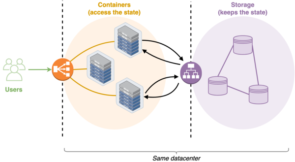
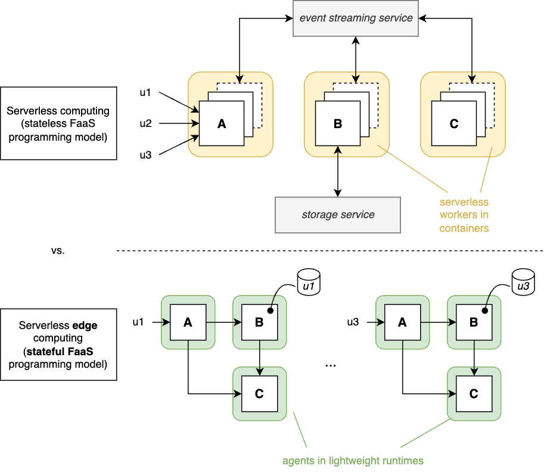

# Serverless edge computing

Function-as-a-Service (FaaS) is a programming model where a developer only
writes functions.
They are then deployed in a run-time environment managed by a serverless
platform in the cloud, which takes care of the auto-scaling of the containers
that are used to execute the functions based on the instantaneous user demands.
This enables, at least in principle, infinite scalability with no burden on the
developer or service provider.

FaaS implicitly assumes that all functions are stateless (= the output only
depends on the input provided by the users), which is key to allow the
serverless platform to scale up/down the number of containers dedicated to a
given function.
Since not all services can be made of pure stateless functions only, the
typical architecture used in serverless production systems also involves a
storage system that is used to keep the applications’ states: when a container
is activated to execute a given stateful function, it first retrieves the state
from the storage system, then it runs the function, and finally it updates the
state in the storage system (if modified).

This approach does not suit well the characteristics and limitations of a
edge computing infrastructions, where storage/processing resources may be
distributed in a large area and interconnected via unreliable or slow networks.
Furthermore, edge infrastructures are much more heterogeneous than their cloud
counterparts, which makes it more difficult to implement efficient autoscaling
like in mature cloud-oriented container management platforms like
[K8s](https://kubernetes.io/).

In EDGELESS we explore a different paradigm, where each individual
application/session is assigned a _workflow_, where processing is done in
_functions_ and triggers/sinks are realized through _resources_, all running on
edge or cloud nodes.
Unlike in traditional FaaS, the functions are **stateful**, which allows the
developer to manage the application's state locally without the need for
an external storage system.

