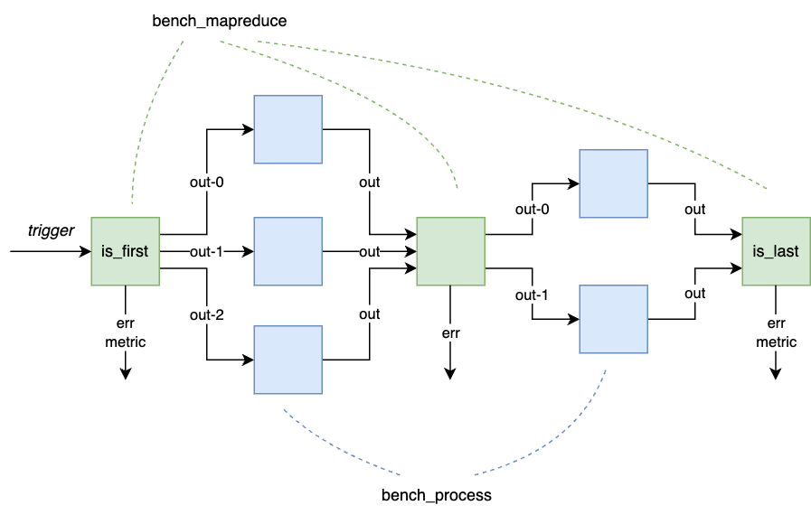

### Benchmark map-reduce

This directory contains some examples on how to define workflows with
map-reduce functions, which are intended to be used within `edgeless_benchmark`.

Workflow example:



First, build the `bench_mapreduce` and `bench_process` WASM binaries following
the [instructions](../../functions/README.md). 

To start a workflow using only the `bench_mapreduce` function:

```
ID=$(target/debug/edgeless_cli workflow start examples/bench_mapreduce/workflow-mapreduce-only.json)
```

To stop the worfklow:

```
target/debug/edgeless_cli workflow stop $ID
```