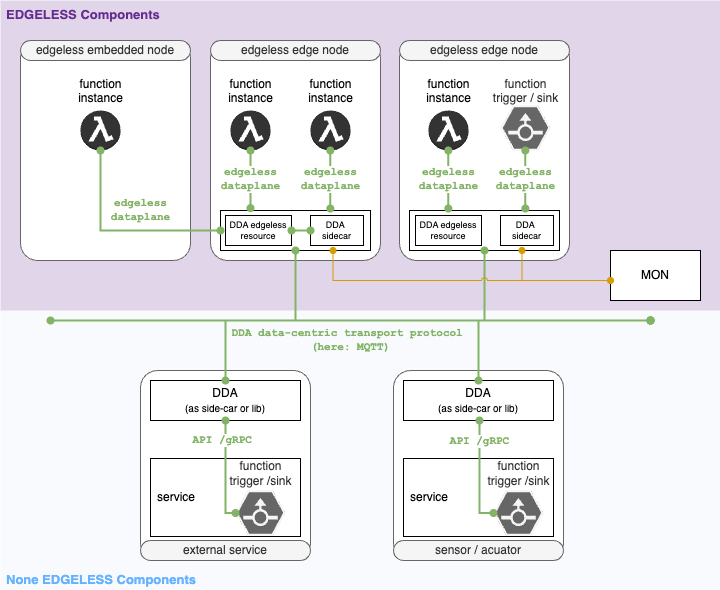
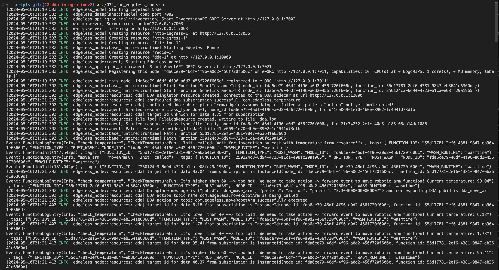
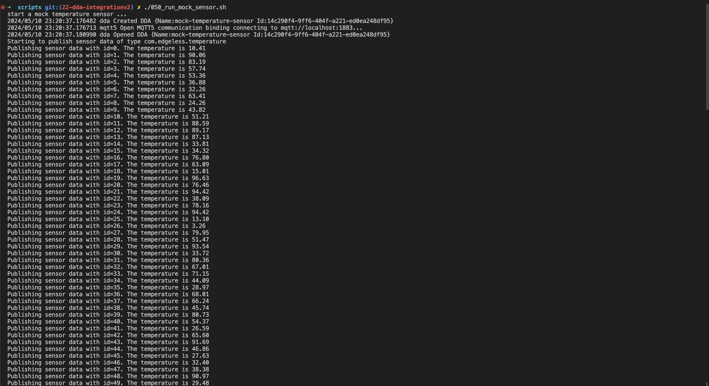
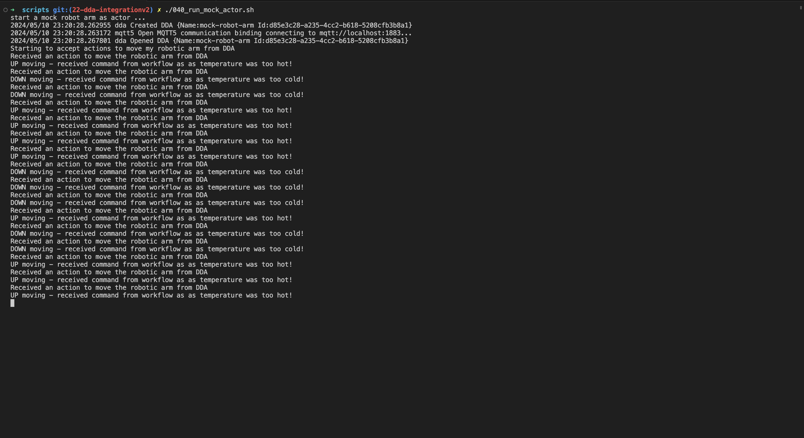

# Edgeless Data Distribution Agent (DDA) - Demo

The readme is divided into two major parts. Part 1 explains the [demo setup](#setting-up-the-demo) and runs it. Part 2 talks about [usage of the DDA resource in EDGELESS workflows](#usage-of-the-dda-resource-in-edgeless-workflows) to create other functions.

## Objective of these demos

The purpose of this demo is to showcase the capabilities of the DDA sidecar in conjunction with functions that utilize the Data Distribution Agent as a component of Edgeless. This demo highlights how serverless functions and workflows can communicate through a decentralized, data-centric mesh, both internally and with external systems. The diagram below illustrates the architecture of this mesh.

This concept is realized based on an Open Source Component also called DDA available  [here](<https://github.com/coatyio/dda>).

## Prerequisites

To successfully run and interact with the demo, the edgeless environment needs to be configured and built. If you have this already up and running, you can skip the next section.

### Edgeless - Build, configure and run the EDGELESS framework

#### Build EDGELESS

Make sure you have build all artifacts and binaries from the EDGELESS core. For details on doing this for the different platforms, check the documentation here - [building guide](../BUILDING.md).

After completing this you should have the following executables in the directory `target/debug/` from the repository root:

| Executable name   |
| ----------------- |
| `edgeless_con_d`  |
| `edgeless_orc_d`  |
| `edgeless_node_d` |
| `edgeless_cli`    |

### Configure Edgeless

All components available need there respective configuration files. For conenvience you find in `examples/dda_demo/scripts` a script `./010_create_edgeless_configs.sh` to generate the config files for the DDA Demo(s).

## Setting up the demo

We assume that the [prerequisites](#prerequisites) are already available. To setup the demo, you need to move to folder `examples/dda_demo/scripts` and follow the steps.

### Data Distribution Agent (DDA) - Setup und run the DDA environment for EDGELESS

DDA needs a MQTT broker to publish and subscribe to actions and events. So we need to setup a MQTT broker and configure access to the broker in all dependent functions.

1. Setup and run a MQTT Broker, for ex `Mosquitto`
2. Configure MQTT Broker for all DDAs in the demo setup:
   1. DDA sidecar configuration for the DDA EDGELESS resource: `dda.yaml` in the parent folder `examples/dda_demo/dda.yaml`.
   2. None EDGELESS comoponents and services like for instance the two mock services in `examples/dda_demo/mock-services/mock-robot-arm` and `examples/dda_demo/mock-services/mock-temperature-sensor`. 
3. DDA has a dependency on `go`. So make sure that `go` is installed and path is accessible in environment.
4. Run the EDGLESS DDA sidecar by running `020_run_dda.sh`.

### Run EDGELESS controller, orchestrator and Edgeless node

Next, we start the edgeless controller, orchestrator, and node components.

1. In the `scripts` folder, run `./030_run_edgeless_ctrl.sh` to start the controller.
2. Run `./031_run_edgeless_orc.sh` to start the orchestrator.
3. Run `./032_run_edgeless_node.sh` to start one edgeless node.

You are now ready to deploy workflows and functions via the EDGELESS cli.

## Demo 1: Temperature and RobotArm Workflow

### Demo Flow

1. The Demo consists of:
   - two mock services - a. a mock temperature service, which continously issues temperature data via its DDA using the event pattern, and b. a mock robot arm, which can be moved based on action commands received via its DDA.
   - an EDGELESS workflow, consisting of a DDA resources and two functions a. a check temperature function which checks if a temeprature is in a certain range, and b. a function which generates a movement command based on the data received from the check temperature function.
1. The DDA subscribes to temperature events according its configuration in the workflow.
1. As soon as a temperature event is received by the DDA, it issues a cast event to the check temperature function according its internal mapping of topics to casts on the dataplane.
1. The check temperature function process the data of the event, and depending on the result a cast to the move arm function is issued on the dataplane with a corresponding parameter.
1. The move arm function processes the event and the data, and calculates a command for the robot arm. The command is issued as Action pattern via the DDA resource.
1. The mock robot arm receives the event via the DDA, moves the arm according the command up or down and ackknowlegdes the Action pattern via the DDA back to the move arm function.

### Run the mock services

After setting up the EDGELESS and DDA environment according the two previous sections we start next the none EDGELESS mock services.
The two mock services use each use a DDA by means of an integrated DDA library to publish and subscribe to the MQTT broker. The `mock_temperature_sensor` publish certain random temperature in a pre-defined time interval. The second mock service `mock_robot_arm` imitates movement of a robot arm depending on the commands received from the demo workflow.

1. Run `mock_robot_arm` with the script `./040_run_mock_actor.sh`. This service mocks movement of a robot arm. It prints robot arm motion in console in response to action sent from edgeless resource.
2. Run `mock_temperature_sensor` with the script `./050_run_mock_sensor.sh`. This service mocks a sensor which sends out random temperature readings in a fixed time interval. The function `check_temperature` (introduced in the next section) checks the temperature and invokes an action when needed.

### Build the demo functions

In the `dda_demo/functions` folder you can find two previously described EDGELESS functions necessary for the workflow:

1. `check_temperature` - Check temperature functions waits for temperature events from DDA resource. When it receives a temperature, it checks it against a predefined range. If the temperature is higher than the threshold of 60 or lower than 40, it invokes the `move_arm` function, and sends the differnence to the range as additional parameter.
2. `move_arm` - The move arm function is triggered as an action in response to the temperature anomaly identified in `check_temperature` function. The function calcalutes a control parameter (10% of the temperature difference) and uses this to invoke  the `mock_robot_arm` external mock services via the DDA as action command.

The functions can be build by calling `./060_build_demo_functions.sh` both for the check temperature function and the move_arm function. 

### Deploy the workflow and finally run the demo end-to-end

Now that we have all the dependencies up and running, let's run the demo.

1. Deploy and run workflow with `UUID=$(../../../target/debug/edgeless_cli workflow start ../workflow.json)` or call  `./070_run_demo_robotarmmock.sh` in the `scripts`folder.

You should see in

1. `edgless node` console (the one where `./032_run_edgeless_node.sh` is running) 
2. `mock_temperature_sensor` console (the one where `./050_run_mock_sensor.sh` is running) 
3. `mock_robot_arm` console (the one where `./040_run_mock_actor.sh` is running) 

## Usage of the DDA resource in EDGELESS workflows

The configuration of a `dda resource` in edgeless is done in the corresponding`workflow.json`. Inside the `workflow.json`, configuration for dda topics to be subscribed and dda publications to be performed are passed in form of a JSON string.

This can be done by modifying the two dollowing fields that need to be updated to be used in other settings.

1. `dda_com_subscription_mapping`: The subscription array is an array of json objects that define which topics to subscribe to and what to do when an event is encountered. It contains following fields
   1. `ddatopic`: This is the topic name to which DDA should subscribe to.
   2. `ddapattern`: It defines the ddapattern should be used. Currently only the `event` one-way pattern is supported. In future all other DDA patterns will be supported.
   3. `cast_mapping`: Defines which identifier will be used to forward  the event via the dataplane to a specific function.
2. `dda_com_publication_mapping`: The publication array is an array of json objects which define which calls should the dda resource handle, and how would it behave in that case. It contains following fields
   1. `pubid`: Defined which dataplane messages should the dda resource be listening for.
   2. `ddatopic`: Defines which ddatopic the cast/call should be mapped to. In the current implementation, it only performs `publish action` pattern. In future, it will be extended to other patterns as well.

Please be advised that currently the local store features, and the state synchronisation via RAFT as further core features of the DDA are not yet implemented. These features will be made availble in future.

## License

Code and documentation copyright 2024 Siemens AG.

Code is licensed under the [MIT License](https://opensource.org/licenses/MIT).

