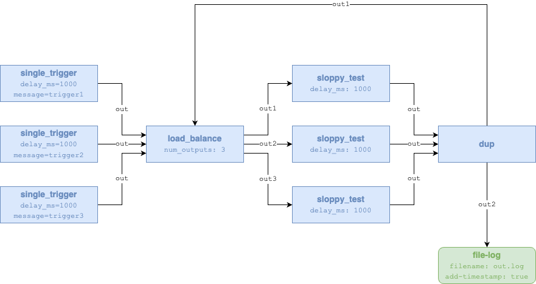

### Load balancer example

The example deploys the following workflow:



In the example, the function `sloppy_test` emulates a resource-bound function
instance, which takes 1 second to complete a single function invocation.

Therefore, the maximum throughput that can be achieved with a single instance
of `sloppy_test` is 1 call/second.

With the `load_balancer` function, we can overcome that limitation by creating
multiple instances of the `sloppy_test` function, which are invoked in round
robin.

After building the WASM bytecode of the functions involved, following the
[instructions](../../functions/README.md), and assuming you have a working
EDGELESS cluster (e.g., with `edgeless_inabox`), you can start the example
workflow with:

```shell
ID=$(target/debug/edgeless_cli workflow start examples/load_balancer/workflow.json)
```

You can visually monitor the message throughput by checking the file `out.log`
in the working directory of the node with a `file-log` resource.

Output example (note 9 messages in 3 seconds):

```shell
2025-10-30T11:44:04.817182+00:00 trigger2
2025-10-30T11:44:04.817490+00:00 trigger1
2025-10-30T11:44:04.817573+00:00 trigger3
2025-10-30T11:44:05.820280+00:00 trigger3
2025-10-30T11:44:05.820602+00:00 trigger2
2025-10-30T11:44:05.820645+00:00 trigger1
2025-10-30T11:44:06.825007+00:00 trigger3
2025-10-30T11:44:06.825218+00:00 trigger2
2025-10-30T11:44:06.825718+00:00 trigger1
```

Stop the workflow with:

```shell
target/debug/edgeless_cli workflow stop $ID
```