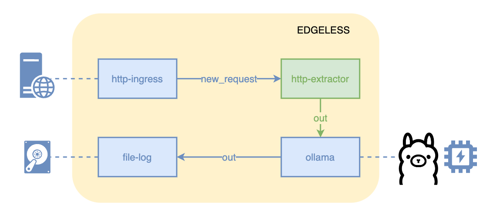

### Ollama example

The example creates a workflow that queries an ollama server.



Install [ollama](https://ollama.com/), e.g., by following the
[quick-start instructions](https://github.com/ollama/ollama/blob/main/README.md#quickstart).

Pull the `llama3` model llama on the server running ollama.

```shell
ollama pull llama3
```

Make sure ollama is working by invoking, e.g.:

```shell
ollama run llama3 "how are you?"
```

Build EDGELESS (following [instructions](../../BUILDING.md)).

Create the default configuration files for the EDGELESS components:

```shell
target/debug/edgeless_inabox -t
```

Check that the ollama configuration in `node.toml` is correct, in particular
that the `ollama_host` refers to the server running ollama, which must be
reachable from the machine running `edgeless_inabox`.

Start `edgeless_inabox` in a shell:

```shell
target/debug/edgeless_inabox
```

In another shell, start the workflow with:

```shell
ID=$(target/debug/edgeless_cli workflow start examples/ollama/workflow.json)
target/debug/edgeless_cli workflow stop $ID
```

You can interact with the LLM via curl, e.g.:

```shell
echo "how are you?" | curl -H "Host: demo.edgeless.com" -d@- http://127.0.0.1:7035/
echo "what did I just ask" | curl -H "Host: demo.edgeless.com" -d@- http://127.0.0.1:7035/
echo "are you sure?" | curl -H "Host: demo.edgeless.com" -d@- http://127.0.0.1:7035/
```

You will find three lines in the `ollama.log` file produced by the file-log
resource, each containing a response to the corresponding question asked.

You can stop the workflow with:

```shell
target/debug/edgeless_cli workflow stop $ID
```