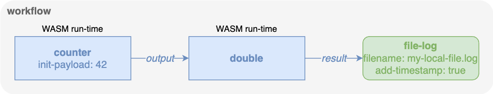

### Serverless example (advanced)

The example creates a workflow where a message is generated periodically by
the `counter` function, which increments the value at each new message,
and then fed to a function vs. resource, which doubles the incoming value
and finally sends the result to a resource that saves the output to a file.

The two workflows are:

- `workflow-wasm.json`, which uses the `double` WebAssembly function
- `workflow-serverless.json`, which uses a serverless resource provider that 
  assumes that an [OpenFaaS](https://www.openfaas.com/) function is reachable
  on localhost at port 5000

The example is meant to highlight the differences between the use of
a function vs. resource to perform the same task.

#### Common steps

Make sure you have a local working copy of EDGELESS, see the
[building instructions](../../BUILDING.md) for that, and that you have created
the default templates for the ε-CON, ε-ORC, node, and command-line:

```shell
target/debug/edgeless_inabox -t
target/debug/edgeless_cli -t cli.toml
```

If not done already, build the `counter` and `double` WASM binaries following
the [function building instructions](../../functions/README.md).

#### Function in the WebAssembly run-time

In the following we create the simple workflow illustrated below.



Start in one shell the EDGELESS-in-a-box:

```shell
target/debug/edgeless_inabox
```

In another create the workflow with:

```shell
target/debug/edgeless_cli workflow start examples/serverless/workflow-wasm.json
```

The `counter` function is inititialized with `42`, so in the file
`my-local-file.log` there will be entries starting with 84 and increasing
by two every second, e.g.:

```text
2025-05-21T14:58:13.741044+00:00 86
2025-05-21T14:58:14.743848+00:00 88
2025-05-21T14:58:15.747594+00:00 90
2025-05-21T14:58:16.749521+00:00 92
2025-05-21T14:58:17.752640+00:00 94
```

You can now terminate the EDGELESS system by issuing Ctrl+C on the shell
where `edgeless_inabox` is running.

#### Serverless resource provider

The example will now be repeated by using the workflow in the diagram below.


You may notice that the `double` box is now a resource (green color) instead
of a function like in the previous example.
This means that the node has to _expose_ a corresponding resource provider.
To do this, we have to modify the default `node.toml` by the following lines:

```ini
[[resources.serverless_provider]]
class_type = "double"
version = "0.1"
function_url = "http://localhost:5000"
provider = "double-1"
```

This will create a resource provider called `double-1` exposing resources of
type `double` (the version `0.1` is unused at the moment) that perform the
action required via an OpenFaaS-compatible function that is expected to be
reachable at the given URL.

After executing in one shell the EDGELESS-in-a-box:

```shell
target/debug/edgeless_inabox
```

the availability of the new resource provider can be verified via:

```shell
target/debug/proxy_cli show node resource-providers
```

or:

```shell
target/debug/edgeless_cli domain inspect all
```

Before starting the workflow, we should start a serverless function that answers
to function calls at the specified URL `http://localhost:5000`.
For that let us download a trivial implementation of the `double` function
following the OpenFaaS specifications.

```shell
wget https://raw.githubusercontent.com/edgeless-project/cnr-experiments/refs/heads/main/openfaas_resources/double/requirements.txt
wget https://raw.githubusercontent.com/edgeless-project/cnr-experiments/refs/heads/main/openfaas_resources/double/index.py
mkdir function && cd function
wget https://raw.githubusercontent.com/edgeless-project/cnr-experiments/refs/heads/main/openfaas_resources/double/function/handler.py
cd -
```

Then, let's create a Python virtual environment and install the dependencies:

```shell
python3 -m venv my-env
source my-env/bin/activate
pip install -r requirements.txt
```

We can now run the serverless `double` function:

```shell
python index.py
```

Let us now start the workflow with:

```shell
target/debug/edgeless_cli workflow start examples/serverless/workflow-serverless.json
```

You can check the content of `my-out.log` and verify that, like in the previous
example with `double` as a WebAssembly function, every second there is a new
line with increasing even numbers.

The file `my-err.log`, which captures the serverless function errors, should be
empty.
Now shut down the serverless function by hitting Ctrl+C on the shell with the
Python script.
You should verify that the `my-out.log` file does not change anymore, but
every second there is a new line in the `my-err.log` file with (e.g.):

```text
2025-05-21T15:15:52.085070+00:00 error when calling serverless function at http://localhost:5000 for resource 9deb9e00-22d4-4fcb-9d38-0f6bbea5f9ed: error sending request for url (http://localhost:5000/): error trying to connect: tcp connect error: Connection refused (os error 61)
```