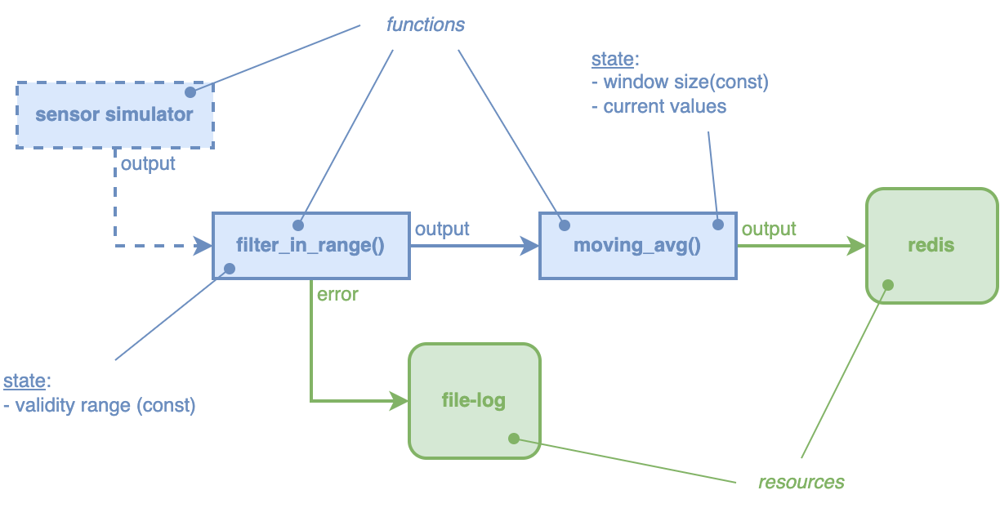

### tutorial-01 example



Build the WASM binaries:

```
target/debug/edgeless_cli function build examples/tutorial-01/filter_in_range_function/function.json
target/debug/edgeless_cli function build examples/tutorial-01/moving_avg_function/function.json
target/debug/edgeless_cli function build examples/tutorial-01/sensor_simulator_function/function.json
```

Then you can start and stop the workflow with:

```
ID=$(target/debug/edgeless_cli workflow start examples/tutorial-01/workflow.json)
target/debug/edgeless_cli workflow stop $ID
```